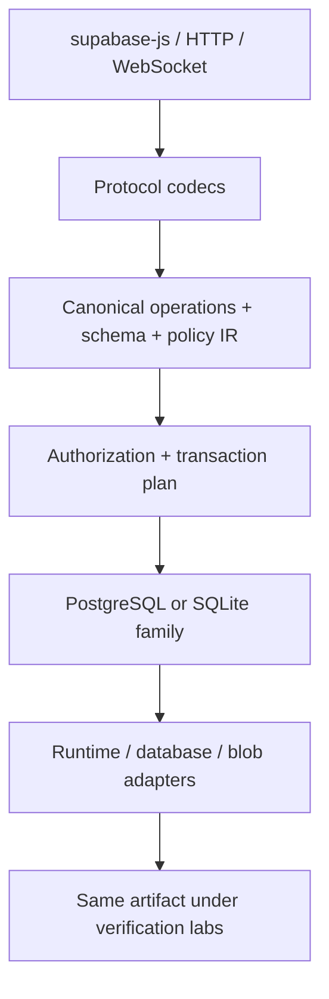
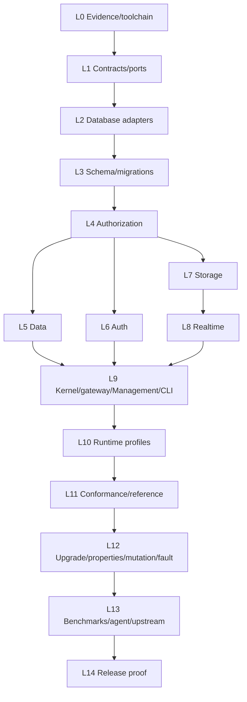

# SupaKernel — contrato técnico canónico

**Estado:** especificación de implementación; no contiene implementación de producción  
**Corte de evidencia:** 2026-09-05 UTC  
**Implementador objetivo:** Claude Sonnet  
**Versión del contrato:** 1.0.1

> Este documento es normativo. “DEBE”, “NO DEBE” y “RECHAZAR” son requisitos de aceptación. En la investigación, **FACT** significa evidencia pública comprobable; **INFERENCE**, una conclusión explícita a partir de esa evidencia; **DESIGN DECISION**, una elección de SupaKernel. Salvo los párrafos marcados FACT/INFERENCE, §§3–33 son DESIGN DECISION normativa. Una afirmación de capacidad sólo cuenta cuando el comprobante ejecutable definido aquí pasa.

## 1. EXECUTIVE TECHNICAL VERDICT

**Veredicto:** confirmar la hipótesis, pero reducir y endurecer su frontera. SupaKernel debe ser **un runtime de backend portable con un único núcleo semántico y un laboratorio de verificación que prueba exactamente ese mismo artefacto**. No debe ser un clon completo de Supabase, una copia de BKND, un fork de Supalite ni una segunda versión interna de SupaDiff.

La arquitectura correcta es:



**DESIGN DECISION.** El producto implementa un subconjunto profundo de Data, Auth, Storage, Realtime y Management. La compatibilidad se mide por escenarios ejecutados con `@supabase/supabase-js@2.115.0` contra Supabase local, Supalite y SupaKernel; no por similitud nominal. PostgreSQL y SQLite son las dos únicas familias semánticas. PGlite cuenta como PostgreSQL; `node:sqlite`, `bun:sqlite`, D1 y SQLite-WASM/OPFS son adaptaciones de SQLite, no bases adicionales.

Un solo proyecto puede cubrir el benchmark porque las dimensiones comparten una causa técnica: traducir una superficie compatible a semántica relacional y de seguridad estable a través de entornos incompatibles. El laboratorio no es un proyecto lateral: importa los paquetes publicados de SupaKernel y sus pruebas fallan si el runtime real diverge. El proyecto **no** puede, por sí solo, demostrar ownership en un repositorio ajeno; por eso genera paquetes de evidencia upstream, pero un issue o PR sólo cuenta tras aceptación externa.

Condición de éxito global: la matriz final de §31 debe quedar verde sobre un tag reproducible, incluyendo vendor differential, dos familias de base, seis perfiles runtime reales, invariantes de seguridad/fallo, upgrade verificado y benchmark capability-matched. Que exista código, un adapter o una prueba mock no satisface ninguna fila.

## 2. RESEARCH GROUND TRUTH

### 2.1 Dennis Senn, BKND y Lite

- **FACT.** Dennis Senn (`@dswbx`) se identifica públicamente como creador/mantenedor de BKND y miembro de Supabase y BKND. Supabase anunció el 3 de febrero de 2026 que se incorporó para construir Supabase Lite para workloads agénticos; BKND permanece open source. Fuentes: [perfil](https://github.com/dswbx), [anuncio oficial](https://supabase.com/blog/bknd-joins-supabase).
- **FACT.** [BKND](https://github.com/bknd-io/bknd) es un backend TypeScript basado en la Minimum Common Web Platform API. Su superficie pública incluye Data, Auth, Media, Flows, MCP, UI y adapters para Node, Bun, Deno, browser, Cloudflare, serverless, SQLite y PostgreSQL. El repositorio usa Hono, Kysely, Bun/Vitest/Playwright y suites de conexión compartidas. Fuentes: [README](https://github.com/bknd-io/bknd/blob/main/README.md), [CONTRIBUTING](https://github.com/bknd-io/bknd/blob/main/CONTRIBUTING.md), [package.json](https://github.com/bknd-io/bknd/blob/main/app/package.json).
- **FACT.** La PR de BKND [#280](https://github.com/bknd-io/bknd/pull/280), escrita por Dennis y fusionada, añadió políticas `allow`/`deny`/`filter` similares a RLS sobre una arquitectura de permisos; su propia lista de tareas deja varias superficies sin contexto o cobertura integral. La PR [#291](https://github.com/bknd-io/bknd/pull/291), también fusionada, integró PostgreSQL, browser+OPFS, OTP y adapters adicionales en 0.20.
- **FACT.** [`dswbx/lite-projects`](https://github.com/dswbx/lite-projects) ejecuta generaciones cold-start con combinaciones fijas de modelo/stack/prompt, impide leer runs hermanos y exige logs estructurados de progreso, fricción y propuestas. Es evidencia directa de agent DX experimental, no un benchmark neutral de modelos.
- **FACT.** El rol oficial [Supalite Engineer](https://jobs.ashbyhq.com/supabase/b75ba81e-54cc-4393-a575-bc41776b0113) sigue listado en [Supabase Careers](https://supabase.com/careers) a la fecha de corte. Pide una implementación TypeScript ligera e intercambiable entre SQLite/Postgres, compatibilidad PostgREST/Auth para usar `supabase-js`, conformance contra hosted, provisioning sub-second, scale-to-zero, CLI/DX, upgrade a Supabase y capacidad de leer GoTrue/Go y PostgREST/Haskell y reproducir su comportamiento.
- **FACT.** La PR de Supabase [#48304](https://github.com/supabase/supabase/pull/48304), de Dennis, propuso un Platform Kit adapter-driven para Supabase y Supalite, con `supabase-js`, OpenAPI y `/_system/introspect`; fue cerrada como draft y no fusionada. Es evidencia de trabajo técnico, no contribución aterrizada.
- **INFERENCE.** El benchmark observable fuerte de Dennis no es un número de commits. Es: haber llevado un backend amplio a múltiples runtimes/bases, diseñar autorización y DX, mantener un codebase público, y ahora trabajar en compatibilidad Lite. SupaKernel debe responder con propiedades ejecutables equivalentes, no con conteos.

### 2.2 Supalite público y límite closed-source

- **FACT.** `@supabase/lite@0.10.0` fue publicado el 2026-09-03 como alpha; declara una implementación TypeScript de Supabase sobre SQLite, PGlite y PostgreSQL, compatible parcialmente con PostgREST/GoTrue y `supabase-js`. El tarball público expone documentación, JavaScript compilado y `.d.ts`, pero no TypeScript fuente ni sourcemaps. Metadatos: [paquete npm](https://www.npmjs.com/package/@supabase/lite/v/0.10.0).
- **FACT.** Los repos públicos anunciados en la documentación (`supabase/supabase-lite` y `supabase-community/lite`) no son accesibles públicamente a la fecha de corte. El propio [`lite-projects/AGENTS.md`](https://github.com/dswbx/lite-projects/blob/main/AGENTS.md) ordena tratar `@supabase/lite` como paquete cerrado y usar sólo paquete/docs públicos.
- **DESIGN DECISION.** Supalite se trata como **black box público**: se permite instalar el tarball, leer sus archivos publicados y observar su API; se prohíbe inferir módulos privados o copiar JavaScript compilado. La licencia del tarball no convierte en público un repositorio inaccesible.
- **FACT.** La documentación empaquetada de 0.10.0 declara 53/74 métodos Data efectivos en SQLite y 72/74 en PostgreSQL; Auth cubre 23/63, Storage 20/20 de su suite declarada, Realtime y Edge siguen incompletos. Declara suites derivadas de PostgREST/Auth con miles de casos, pero el código de esas suites no se distribuye; por tanto el volumen no es auditable externamente.
- **FACT.** Las limitaciones públicas incluyen: no `rpc()` en SQLite; RLS de SQLite reescrito en app con limitaciones de `WITH CHECK`; `FORCE RLS` ignorado; OAuth sólo GitHub/Google; sin MFA/admin/phone; D1 sin transacción callback para spans Auth; Vite no monta Storage; y upgrade sin Storage/Realtime.
- **FACT.** La documentación 0.10.0 afirma resetear secuencias tras importar IDs. Sin embargo, el issue [lite-projects #69](https://github.com/dswbx/lite-projects/issues/69) contiene una reproducción independiente actual contra 0.10.0 donde un `bigserial` migrado conserva filas pero el siguiente insert colisiona. Ésta es una contradicción observable entre contrato declarado y comportamiento.
- **FACT.** [lite-projects #64](https://github.com/dswbx/lite-projects/issues/64), creado por Dennis, registra dos incompatibilidades de signed URL: `signedUrl` frente a `signedURL` y duplicación de `/storage/v1`; Dennis lo validó y trasladó a LITE-366. SupaDiff lo reprodujo contra Supabase local.

### 2.3 Supabase y superficies de referencia

- **FACT.** [PostgREST](https://github.com/PostgREST/postgrest) está escrito en Haskell y delega en PostgreSQL serialización, constraints, autorización por roles/RLS, introspección y ejecución. Sus semánticas de tablas, filtros, embedding, preferencias, headers y errores son la referencia Data; por ejemplo, upsert usa `Prefer: resolution=merge-duplicates` y `on_conflict`. Fuente: [API de tablas y vistas](https://docs.postgrest.org/en/v14/references/api/tables_views.html).
- **FACT.** [Supabase Auth/GoTrue](https://github.com/supabase/auth) está escrito en Go. Su [OpenAPI](https://github.com/supabase/auth/blob/master/openapi.yaml) define `/signup`, `/token`, `/user`, `/logout`, `/verify`, recovery y admin. La rotación conserva parentesco de refresh tokens y detecta reuso; RFC 9700 prescribe rotación o sender constraint y revocación de la familia al detectar reuso. Fuente: [RFC 9700](https://datatracker.ietf.org/doc/html/rfc9700).
- **FACT.** [Supabase Storage](https://github.com/supabase/storage) es TypeScript/Node, mantiene metadata en PostgreSQL y aplica RLS; además de HTTP soporta TUS y S3. SupaKernel sólo toma la superficie HTTP usada por `storage-js` definida en §14.
- **FACT.** [Supabase Realtime](https://github.com/supabase/realtime) está escrito en Elixir/Phoenix y ofrece Broadcast, Presence y Postgres Changes sin promesa general de entrega. El protocolo vigente usa frames Phoenix y eventos `phx_join`, `phx_reply`, `system` y `postgres_changes`. Fuente: [Realtime Protocol](https://supabase.com/docs/guides/realtime/protocol).
- **FACT.** [Supabase CLI](https://github.com/supabase/cli) es hoy un monorepo pnpm con CLI TypeScript/Bun y una CLI Go legacy; orquesta el stack local real y migrations/types. `supabase@2.116.0` es la versión pública de referencia del corte.
- **FACT.** [supabase/evals](https://github.com/supabase/evals) modela evals como prompt+scorer+entorno y soporta stacks locales/hosted. Su [`packages/platform-lite`](https://github.com/supabase/evals/tree/main/packages/platform-lite), no el monorepo principal, expone una parte real de Management API sobre PGlite, genera tipos desde el OpenAPI upstream y añade PG-wire para flujos CLI. Su código explica expresamente que PG-wire vive allí porque Supalite lo considera non-goal. Fuentes: [README](https://github.com/supabase/evals/blob/main/packages/platform-lite/README.md), [app](https://github.com/supabase/evals/blob/main/packages/platform-lite/src/app.ts), [PG-wire](https://github.com/supabase/evals/blob/main/packages/platform-lite/src/project/pg-wire.ts).
- **INFERENCE.** Duplicar `platform-lite` no aporta señal. SupaKernel debe interoperar con MCP/CLI mediante un subset Management persistente y seguro, y usar `platform-lite` como referencia/conformance target donde coincidan rutas.

### 2.4 Evidencia pública del solicitante

- **FACT.** [SupaDiff](https://github.com/CesarManzoCode/supadiff) es un sistema diferencial, determinista y capability-aware que usa el mismo `supabase-js` contra targets reales, emite artifacts/replay/reduction y tiene un camino real de upgrade. Ha producido los regressions públicos #64/#69. Sus [limitaciones](https://github.com/CesarManzoCode/supadiff/blob/main/docs/LIMITATIONS.md) excluyen Realtime/Edge/UI y no automatizan un hosted efímero completo.
- **FACT.** [Thalyx](https://github.com/CesarManzoCode/thalyx) aporta evidencia de arquitectura de sistemas, kernel/BPF/LSM, aislamiento, signed modules, journal/rollback y fault injection. Su [estado público](https://github.com/CesarManzoCode/thalyx/blob/main/docs/STATUS.md) documenta también límites; no demuestra por sí mismo compatibilidad backend/Supabase ni portabilidad JS.
- **INFERENCE.** SupaDiff ya prueba habilidad de differential debugging y Thalyx seguridad/fallos. La carencia observable frente a Dennis está en un backend TypeScript propio, portable, con Auth/RLS/Storage/Realtime y mantenimiento upstream aceptado. SupaKernel debe cerrar esa brecha sin absorber artificialmente los dos proyectos.

### 2.5 Source ledger y gap matrix

| ID | Fuente primaria | Hecho usado | Fecha/versión | Confianza |
|---|---|---|---|---|
| S01 | Supabase, “BKND joins Supabase” | rol de Dennis y misión Lite | 2026-02-03 | alta |
| S02 | BKND README/CONTRIBUTING/package + PR #280/#291 | arquitectura, runtimes, DB, authz | main/0.20 | alta |
| S03 | lite-projects README/AGENTS/issues #64/#69 | cold starts, límites y bugs | 2026-09-05 | alta |
| S04 | tarball npm `@supabase/lite` | superficie pública y claims | 0.10.0 | alta para contenido; media para resultados no reproducidos |
| S05 | PostgREST/Auth/Storage/Realtime repos y specs | protocolos de referencia | HEAD fijado en L0 | alta |
| S06 | Supabase CLI | stack local y workflow | 2.116.0 | alta |
| S07 | supabase/evals/platform-lite | eval/control-plane/PG-wire | commit fijado en L0 | alta |
| S08 | SupaDiff | conformance y bugs externos | main fijado en L0 | alta |
| S09 | Thalyx | sistemas/security/fault evidence | main fijado en L0 | alta |
| S10 | Node/Bun/Deno/Cloudflare/PostgreSQL docs | toolchain/runtime support | §33 pins | alta |

Huecos que la investigación pública no puede resolver y cómo se cierran sin adivinar:

| Hueco | Regla |
|---|---|
| internals de Supalite | black-box; sólo tarball/docs/API observada |
| semántica exacta cambiante del vendor | fixture ejecutable + SHA/digest lock; nunca memoria humana |
| hosted destructivo/costoso | lane opt-in con proyecto preautorizado; local es gate obligatorio |
| equivalencia SQLite↔PG fuera del subset | rechazo estructurado; no emulación aproximada silenciosa |
| métrica personal “mejor que Dennis” | no se responde; sólo propiedades públicas comparables |

## 3. DENNIS BENCHMARK

Los estados son iniciales al corte. `ABOVE` significa evidencia pública más fuerte en esa propiedad exacta, no superioridad personal. `UNKNOWN` se usa cuando las evidencias no son capability-matched.

| Propiedad observable | Evidencia Dennis | Evidencia solicitante | Inicial | Para PARITY | Para ABOVE | Productor SupaKernel |
|---|---|---|---|---|---|---|
| backend TS coherente | BKND fusionado y mantenido | no existe backend propio comparable | BELOW | release usado por una app real; Data/Auth/Storage integrados | extensión no trivial aceptada por usuarios externos | L5–L10 |
| portabilidad runtime | mismo BKND en Node/Bun/Deno/CF/browser/serverless | Thalyx Linux; SupaDiff es harness | BELOW | mismo core, sin forks de dominio, pasa suites reales en 6 perfiles | bug runtime-specific aislado y corregido upstream | L2/L10 |
| portabilidad DB | BKND SQLite+PG y variantes | compara targets, no ejecuta backend propio | BELOW | mismo scenario suite PG+SQLite con capability manifests honestos | divergencias difíciles minimizadas y correcciones upstream | L2–L5/L11 |
| semántica SQL/migrations | BKND schema/data; trabajo Supalite; upgrade | SupaDiff descubrió sequence bug | BELOW | IR, introspección, diff y upgrade verifican constraints/sequences | bug no trivial aceptado en CLI/Lite/Postgres tooling | L3/L12 |
| Auth/session lifecycle | BKND Auth/OTP; Supalite Auth públicamente observable | sin Auth backend propio | BELOW | GoTrue subset + vendor differential + replay attacks | contribución Auth externa aceptada o nueva clase de bug | L6/L12 |
| row/field authorization | BKND PR #280 fusionada, con TODOs públicos | Thalyx security; SupaDiff RLS testing | BELOW en backend | policy IR, PG native RLS, SQLite rewrite, field masks, adversarial/mutation gates | zero unexplained critical mutants + external authz fix | L4/L12 |
| Supabase compatibility | misión laboral y Supalite package | SupaDiff parity harness y dos bugs | BELOW en implementation; PARITY en debugging | `supabase-js` Data/Auth/Storage/Realtime subset contra local real | upstream defect accepted con regression y broad cross-runtime proof | L5–L12 |
| reference-code comprehension | rol exige Go/Haskell; implementación Lite observable no pública | SupaDiff black-box, Thalyx Linux internals | UNKNOWN | 4 trace chains source→contract→test→implementation | maintainer-accepted correction en una referencia ajena | L11/L13 |
| conformance/differential | Supalite claims grandes suites; lite-projects | SupaDiff público y reproducible | PARITY pública | integrar vendor components + target matrix sin duplicar SupaDiff | encontrar y aterrizar defectos nuevos | L11 |
| fault/recovery | evidencia BKND limitada públicamente | Thalyx fuerte; SupaDiff replay | UNKNOWN por dominio | named fault points + crash/restart invariants backend | encontrar corrupción real y corregirla upstream | L12 |
| performance/footprint | BKND publica ~300 KB gzip y portabilidad | sin benchmark backend capability-matched | BELOW | medición intercalada reproducible sobre intersección | mejora con IC sin sacrificar semántica/durabilidad | L13 |
| agent DX | lite-projects cold-start runs | no harness backend equivalente | BELOW | mismo modelo/tarea compara releases/docs en sandbox frío | mejora estadísticamente repetible y explicación causal | L13 |
| external codebase ownership | BKND y trabajo Supabase público; PRs fusionadas | issues #64/#69; sin fix ajeno fusionado | BELOW | una contribución material aceptada fuera de repos propios | varias contribuciones en lenguajes/componentes distintos con mantenimiento | L13 + trabajo externo real |
| sistemas/security general | BKND platform; no comparación homogénea con kernel work | Thalyx | UNKNOWN | no aplica sin workload común | no se declara | no puntúa |

Reglas de actualización: cada celda enlaza un artifact/tag/PR; un claim caduca si no reproduce en la toolchain bloqueada; una PR draft/cerrada no cuenta como merged; un issue aceptado cuenta como debugging, no ownership; cifras de tests/adapters/LOC jamás cambian un estado por sí solas.

## 4. PROJECT MISSION

SupaKernel es un runtime TypeScript ligero que ofrece un subconjunto explícito de Supabase Data/Auth/Storage/Realtime/Management sobre PostgreSQL y SQLite mediante un núcleo semántico independiente del runtime, y demuestra cada promesa ejecutando el mismo escenario contra implementaciones reales, fallos, ataques y entornos reales. Tiene éxito cuando una app no trivial escrita con `@supabase/supabase-js@2.115.0` puede cambiar sólo URL/keys entre Supabase local y los perfiles soportados de SupaKernel, y la matriz §31 verifica semántica, seguridad, recovery, upgrade, portabilidad y performance sin divergencias ocultas.

## 5. NON-GOALS

- Clonar Supabase completo, BKND, Supalite, Studio o su dashboard.
- Billing, organizations comerciales, branching cloud, analytics, vector, Edge Functions, image transforms, S3 protocol, TUS, Broadcast o Presence.
- Postgres wire protocol: `platform-lite` ya cubre ese experimento; SupaKernel acepta SQL sólo en Management sobre runtimes server autorizados.
- `rpc()`, stored procedures portables, schemas distintos de `public`, FTS, range types, regex, GeoJSON, computed relationships o nesting mayor a un salto en v1.
- OAuth/social, MFA, SAML/SSO, phone/SMS, anonymous auth o manual identity linking.
- Compatibilidad de bytes/errores fuera de escenarios declarados.
- Capturar cambios de escrituras que eluden las tablas/triggers administrados por SupaKernel.
- Prometer exactly-once Realtime o delivery durante una desconexión sin la extensión opt-in de cursor.
- Ejecutar hosted, publicar issues/PRs o migrar datos reales sin autorización humana explícita.
- Optimizar para número de adapters, endpoints, tests, LOC o modelos LLM.

## 6. SYSTEM ARCHITECTURE

### 6.1 Boundaries y flujo

1. `gateway` recibe `Request`, limita body/headers y decodifica el protocolo.
2. El codec produce una operación canónica sin SQL.
3. `kernel` resuelve tenant/proyecto y una `Principal` **sólo** desde credenciales verificadas.
4. `policy` valida acción/campos y produce `SecurityPlan`; valores controlados por cliente nunca crean claims.
5. `schema` valida contra `SchemaIR`; `planner` genera `RelationalPlan` parametrizado.
6. El dialecto compila a `SqlStatement{text, parameters}`. Sólo identificadores provenientes de `SchemaIR` pueden interpolarse y siempre se citan.
7. El adapter ejecuta dentro del `TransactionPlan`; la respuesta se normaliza y el codec produce la forma PostgREST/GoTrue/Storage/Realtime.
8. Observability recibe eventos ya redactados; nunca bodies Auth, JWT, passwords, API keys ni object bytes.

### 6.2 Dependency direction

`contracts → ports → {schema, policy} → services → kernel → gateway → runtime composition`. Adapters implementan `ports` y entran por composición; nunca son importados por services. Tooling y labs importan sólo exports públicos del producto. Se prohíben ciclos con `dependency-cruiser`-equivalent custom rule en `scripts/check-boundaries.mts`.

### 6.3 Process/runtime model

- Un `KernelInstance` representa exactamente un proyecto/tenant y posee handles de DB/blob/clock/random/keys/changefeed.
- Node/Bun/Deno pueden servir muchos proyectos mediante `ProjectRegistry`; Workers usa un Durable Object por proyecto; browser un Dedicated/Shared Worker por proyecto; Lambda resuelve proyecto desde configuración, no del Host arbitrario.
- No hay singletons mutables. Clocks, randomness, UUID, filesystem, network y fault injection son ports.
- Shutdown deja de aceptar requests, drena transacciones hasta 10 s, persiste cursor/outbox y cierra adapters; tras timeout aborta y recovery debe completar en restart.

### 6.4 Trusted boundaries

| Boundary | Confianza | Regla |
|---|---|---|
| HTTP/WS client | ninguna | parse limits, verified credentials, schema validation |
| public API key | identifica proyecto, no principal privilegiado | jamás concede `service_role` |
| JWT | no confiable hasta firma+alg+kid+iss+aud+exp | claims se copian a estructura inmutable |
| Management token | alta, sólo tras hash compare y audience separada | no se acepta por Data/Auth/Storage |
| DB adapter | TCB de persistencia | contract suite y capability attestation |
| Blob adapter | bytes no confiables hasta hash/tamaño | metadata `ready` gobierna visibilidad |
| vendor target | oráculo parcial, no verdad absoluta | versión fijada + divergencias clasificadas |
| eval agent | código hostil | sandbox sin secrets, límites de CPU/red/network |

## 7. MONOREPO / PACKAGE MAP

```text
/
├─ apps/
│  ├─ cli/                         # binario sk; sólo composición/tooling
│  └─ fixture-app/                 # app supabase-js canónica, sin imports internos
├─ packages/
│  ├─ contracts/                   # tipos, schemas JSON, errors; dependency-free
│  ├─ ports/                       # DB/blob/runtime/crypto/clock/fault interfaces
│  ├─ schema/                      # SchemaIR, introspection normalize, diff, dialect DDL
│  ├─ policy/                      # PolicyIR, validation, PG RLS + SQLite predicates
│  ├─ data/                        # PostgREST parse/plan/result mapping
│  ├─ auth/                        # GoTrue subset y session state machine
│  ├─ storage/                     # API, metadata state machine, signed URLs/ranges
│  ├─ realtime/                    # Phoenix codec, outbox/subscriptions/backpressure
│  ├─ management/                  # allowlisted Management API subset
│  ├─ kernel/                      # orchestration de services y project lifecycle
│  ├─ gateway/                     # Hono routes; Request/Response only
│  ├─ db-postgres/                 # postgres.js adapter
│  ├─ db-pglite/                   # PGlite adapter
│  ├─ db-sqlite/                   # core SQLite + node/bun/d1/wasm entrypoints
│  ├─ blob-fs/                     # filesystem adapter
│  ├─ blob-s3/                     # S3/R2 adapter ports; conditional exports
│  ├─ blob-opfs/                   # browser OPFS adapter
│  ├─ runtime-node/
│  ├─ runtime-bun/
│  ├─ runtime-deno/
│  ├─ runtime-workers/
│  ├─ runtime-browser/
│  └─ runtime-lambda/
├─ labs/
│  ├─ conformance/                 # ScenarioSpec/targets/comparator/artifacts
│  ├─ reference-traces/            # source→behavior→scenario manifests
│  ├─ faults/                      # deterministic fault/crash campaigns
│  ├─ mutation/                    # Stryker + semantic mutant catalog
│  ├─ benchmarks/                  # BKND intersection + self matrix
│  ├─ agent-evals/                 # cold-start DX harness
│  └─ upstream-evidence/           # reducer/owner/evidence bundle, no auto-publish
├─ fixtures/                       # versioned schemas/scenarios/object bytes
├─ docs/                           # public product docs and architecture ADRs
├─ scripts/                        # pins, boundaries, provenance, report verification
├─ vendor-lock/                    # SHAs/digests/versions; no vendored source
└─ .github/workflows/              # CI lanes in §33
```

Dependencias prohibidas:

- `contracts` no importa paquetes workspace ni librerías runtime.
- `ports` sólo importa `contracts`.
- `schema` y `policy` no se importan mutuamente; expresiones compartidas viven en `contracts`.
- `data/auth/storage/realtime/management` no importan Hono ni adapters concretos.
- `db-*`, `blob-*`, `runtime-*` no importan services; implementan ports.
- `gateway` no contiene reglas de dominio, SQL ni authz.
- `labs/*` no usa rutas internas no exportadas ni monkey patches.
- Ningún paquete salvo `schema` y `db-*` contiene SQL; SQL de referencia vive como fixture explícita.

## 8. CANONICAL TYPES / INTERFACES

Los nombres y discriminantes siguientes son normativos. Sonnet puede separar declarations en archivos indicados, pero no renombrar conceptos ni añadir `any`.

```ts
type Family = 'postgres' | 'sqlite'
type RuntimeId = 'node' | 'bun' | 'deno' | 'workers' | 'browser' | 'lambda'
type Json = null | boolean | number | string | Json[] | { [k: string]: Json }

interface Principal {
  kind: 'anonymous' | 'user' | 'service'
  subjectId: string | null
  tenantId: string
  role: 'anon' | 'authenticated' | 'service_role' | string
  sessionId: string | null
  claims: Readonly<Record<string, Json>>
  credentialSource: 'none' | 'jwt' | 'secret_key' | 'management_token'
}

interface RequestContext {
  requestId: string
  projectRef: string
  principal: Principal
  now: string                 // RFC3339 UTC from Clock port
  peer: { ipClass: 'loopback' | 'private' | 'public' | 'unknown' }
  abortSignal: AbortSignal
}

type Expr =
  | { kind: 'literal'; value: Json }
  | { kind: 'column'; table: string; name: string }
  | { kind: 'claim'; path: readonly string[] }
  | { kind: 'context'; name: 'subjectId' | 'tenantId' | 'role' | 'now' }
  | { kind: 'compare'; op: 'eq'|'neq'|'gt'|'gte'|'lt'|'lte'|'like'|'ilike'|'in'|'is'; left: Expr; right: Expr }
  | { kind: 'logic'; op: 'and'|'or'; terms: readonly Expr[] }
  | { kind: 'not'; term: Expr }

type QueryOperation =
  | { kind: 'select'; table: string; fields: Selection[]; where: Expr|null; order: Order[]; page: Page|null; cardinality: 'many'|'one'|'maybeOne'; count: 'none'|'exact' }
  | { kind: 'insert'; table: string; rows: readonly Record<string, Json>[]; onConflict: readonly string[]; resolution: 'error'|'merge'|'ignore'; missing: 'null'|'default'; returning: Selection[]|'minimal' }
  | { kind: 'update'; table: string; patch: Readonly<Record<string, Json>>; where: Expr|null; returning: Selection[]|'minimal' }
  | { kind: 'delete'; table: string; where: Expr|null; returning: Selection[]|'minimal' }

interface PolicyRule {
  id: string
  table: string
  action: 'select'|'insert'|'update'|'delete'|'subscribe'|'storage.read'|'storage.write'
  role: string | '*'
  mode: 'permissive' | 'restrictive'
  using: Expr | null
  check: Expr | null
  fields: { read: readonly string[]|'*'; write: readonly string[]|'*'; immutable: readonly string[] }
}

interface SecurityPlan {
  decision: 'allow'|'deny'
  rowUsing: Expr | null
  rowCheck: Expr | null
  readableFields: ReadonlySet<string>
  writableFields: ReadonlySet<string>
  fingerprint: string
}

interface DatabaseCapabilities {
  family: Family
  transactions: 'callback'|'atomic-batch'|'none'
  ddlAtomicity: 'transactional'|'step-journal'
  nativeRls: boolean
  returning: boolean
  json: 'native-jsonb'|'json-text'
  changeCapture: 'managed-triggers'|'none'
  isolation: readonly ('read-committed'|'serializable')[]
}

interface DatabaseAdapter extends AsyncDisposable {
  readonly id: string
  readonly runtime: RuntimeId
  readonly capabilities: DatabaseCapabilities
  execute(statement: SqlStatement, tx?: Transaction): Promise<DbResult>
  transaction<T>(options: TransactionOptions, fn: (tx: Transaction) => Promise<T>): Promise<T>
  atomicBatch(statements: readonly SqlStatement[]): Promise<readonly DbResult[]>
  introspect(): Promise<ObservedSchema>
  close(): Promise<void>
}

interface BlobAdapter extends AsyncDisposable {
  readonly id: string
  putStaged(opId: string, body: ReadableStream<Uint8Array>, expected: BlobExpectation): Promise<StagedBlob>
  promote(staged: StagedBlob, finalKey: string): Promise<void>
  open(key: string, range?: ByteRange): Promise<BlobRead>
  stat(key: string): Promise<BlobStat|null>
  delete(key: string): Promise<void>
  listStaged(olderThan: string): AsyncIterable<StagedBlob>
}

interface RuntimeAdapter {
  readonly id: RuntimeId
  serve(handler: (request: Request) => Promise<Response>, options: ServeOptions): Promise<ServerHandle>
  upgradeWebSocket?: (request: Request, session: RealtimeSession) => Promise<Response>
  env(name: string): string | undefined
  hardLimits: RuntimeLimits
}

interface ScenarioSpec {
  schemaVersion: 1
  id: string
  capability: string
  requires: readonly string[]
  setup: readonly ScenarioStep[]
  operations: readonly ScenarioStep[]
  observe: readonly ObservationSpec[]
  compare: ComparisonSpec
  normalization: readonly NormalizerId[]
  unsupported?: { targets: readonly string[]; code: string; reason: string }
  seed: string
}

interface KernelError {
  category: 'input'|'authn'|'authz'|'conflict'|'not_found'|'capability'|'integrity'|'rate_limit'|'internal'
  code: string
  message: string
  details: Json | null
  hint: string | null
  httpStatus: number
  retryable: boolean
  causeId?: string
}
```

`SchemaIR` es JSON-serializable y versionado: `ProjectSchema{version, tables, sequences, policies}`; `Table{name, columns, primaryKey, uniques, foreignKeys, checks, indexes}`; `Column{name,type,nullable,default,generated}`; `Sequence{name,ownedBy,start,increment,min,max,cycle}`. Tipos portables v1: `bool`, `int32`, `int64` (wire string cuando excede safe integer), `float64`, `decimal` (wire string), `text`, `uuid`, `date`, `timestamp`, `timestamptz`, `json`, `bytes`, `enum`. Todo tipo fuera de la lista produce `SK_CAP_SCHEMA_TYPE_UNSUPPORTED` antes de mutar estado.

Los codecs mapean `KernelError`; no lanzan objetos ad hoc. `internal` nunca expone SQL, stack, paths, hashes de password, keys ni nombres de buckets privados. Los tests de snapshots fijan forma HTTP por servicio.

## 9. DATABASE CONTRACT

### 9.1 Matriz obligatoria

| Adapter | Familia | Runtime(s) gate | Persistencia | Nivel |
|---|---|---|---|---|
| `postgres.js` → PostgreSQL 18.6 | PostgreSQL | Node, Bun, Deno, Lambda | servidor real | obligatorio |
| PGlite 0.5.8 | PostgreSQL | Node, Bun, Deno, browser | memoria/archivo/OPFS según host | obligatorio |
| `node:sqlite` | SQLite | Node 24.20 | archivo + memoria | obligatorio |
| `bun:sqlite` | SQLite | Bun 1.4.1 | archivo + memoria | obligatorio |
| D1 binding | SQLite | Cloudflare workerd real | D1 local + preview | obligatorio |
| `@sqlite.org/sqlite-wasm@3.53.0-build1` + OPFS | SQLite | Chromium WebWorker | OPFS | obligatorio |

No se declara “PostgreSQL soportado” por PGlite solamente: el gate incluye PostgreSQL real. No se declara “Workers” con Miniflare puro: la lane usa `wrangler dev`/workerd y `@cloudflare/vitest-pool-workers`; una smoke opt-in deploya a una cuenta autorizada. Lambda usa PostgreSQL; Vercel puede añadirse después sólo si ejecuta el mismo adapter Lambda-like, sin contar como runtime nuevo.

### 9.2 Semántica portable

| Tema | Contrato canónico |
|---|---|
| `NULL` | lógica SQL ternaria; comparaciones con null sólo mediante `is.null`/`not.is.null`; missing JSON ≠ explicit null en inserts |
| `UNIQUE` | múltiples NULL permitidos; conflictos se identifican por PK o unique exacta; nombres de constraint se normalizan |
| IDs | UUID v4 desde `Random` o identity entero; jamás `max+1` durante operación normal |
| serial/identity | representado por `Sequence.ownedBy`; introspección debe conservarlo incluso si SQLite lo emula |
| FK | activas siempre; `NO ACTION`, `RESTRICT`, `CASCADE`, `SET NULL`; deferrable se rechaza v1 |
| defaults | literal, current timestamp UTC, UUID v4, identity; ninguna función arbitraria |
| checks | sólo `Expr` portable; SQLite y PG deben rechazar la misma fila |
| transactions | todas las mutaciones de servicio son atómicas; Auth refresh requiere CAS+insert en una transacción o atomic batch |
| isolation | `serializable` para migration/upgrade/refresh; `read-committed` para CRUD PG; SQLite usa `BEGIN IMMEDIATE` para writes |
| upsert | `error`, `merge` o `ignore`; conflict target debe ser PK/unique introspectada; policy INSERT y UPDATE se evalúan en merge |
| returning | emulación SQLite sólo dentro de la misma transacción; si adapter no puede, capability rejection |
| coerción | input JSON validado según tipo; no coerción booleana/numérica “truthy”; fechas RFC3339; decimal/int64 preservan precisión |
| timestamps | almacenados/comparados UTC; `timestamptz` devuelve RFC3339 con `+00:00`; `timestamp` no gana zona implícita |
| JSON | PG `jsonb`; SQLite texto JSON canónico validado; subset de filtros sólo acceso escalar explícito |
| indexes | btree single/multi-column, unique y partial con `Expr`; método exótico se rechaza |
| introspection | salida normalizada no puede perder defaults, identity/sequence, constraints, indexes o policies |
| DDL | PG/SQLite transaccional; D1 usa plan step-journal reanudable |

Todos los statements usan parámetros. La única interpolación es un identificador validado contra `SchemaIR` y citado por dialecto. `db-postgres` ejecuta cada request autenticado en una transacción con `SET LOCAL ROLE` y claims en GUC; `db-sqlite` recibe el `SecurityPlan` ya incorporado al relational plan. `service_role` puede bypass sólo cuando `credentialSource === 'secret_key'`, jamás por un claim `role` suministrado en JSON/JWT no firmado.

### 9.3 Connection contract suite

Cada adapter ejecuta idénticos casos: open/close idempotente, bind de null/bytes/int64/json, constraint mapping, transaction commit/rollback, concurrent writers, isolation declarada, introspección round-trip, RLS/predicate, return rows, trigger outbox, crash/reopen y resource leak. El manifest de capability es comprobado: mentir sobre una capacidad falla `SK_CAPABILITY_ATTESTATION`. Una branch de lógica de dominio condicionada por `adapter.id` está prohibida; sólo el dialect compiler puede bifurcar por `family` y el adapter por primitive capability.

## 10. RUNTIME CONTRACT

“Runtime soportado” significa: bundle sin polyfill global no documentado; arranque en el runtime real; misma fixture app; common core scenario suite; adapter contract; limits; shutdown/restart; no imports incompatibles alcanzables; SBOM y tamaño; y artifact firmado. Los perfiles son:

| Runtime | Versión fija | Servicios obligatorios | DB/blob | Exclusiones explícitas |
|---|---|---|---|---|
| Node | 24.20.0 LTS | todos | PG/node:sqlite/PGlite + FS/S3 | ninguna v1 |
| Bun | 1.4.1 | todos | PG/bun:sqlite/PGlite + FS/S3 | ninguna v1 |
| Deno | 2.9.6 | Data/Auth/Storage/Realtime/Management read-only | PG/PGlite + FS/S3 | Management mutating SQL y SMTP |
| Workers | Wrangler 4.129.0, compatibility date `2026-09-01` | Data/Auth/Storage/Realtime, health | D1 + R2 | raw SQL Management, SMTP, filesystem |
| Browser WebWorker | Chromium Playwright 1.63.0 | Data/Auth/Storage + in-process health | dos perfiles: PGlite y `@sqlite.org/sqlite-wasm@3.53.0-build1`/OPFS + OPFS blobs | listener HTTP público, Realtime socket, Management SQL |
| Lambda | AWS Node 24 container pin | Data/Auth/Storage/health | PG + S3 | Realtime WebSocket, local filesystem durability |

**DESIGN DECISION.** Browser expone un `fetch(request)` mediante `MessageChannel`; el fixture usa un custom `fetch` de `supabase-js`. No se finge un socket. Workers usa `WebSocketPair`; Node usa `ws@8.21.3`; Bun y Deno usan WebSocket nativo. El codec Realtime es común y no importa ninguna implementación.

Límites normativos por defecto: request body 10 MiB Data/Auth, object upload limitado por bucket (50 MiB default), 100 query params, profundidad Expr 12, 1,000 filas de respuesta default/max configurable 10,000, 30 s request server, 10 s shutdown, 1 MiB/1,024-event socket queue. Toda excedencia es error estable, nunca OOM. Runtime profiles pueden reducir límites y deben publicarlos en `/.well-known/supakernel-capabilities`.

## 11. DATA / POSTGREST COMPATIBILITY CONTRACT

### 11.1 Included surface

Base: `/rest/v1`, schema `public`, cliente `@supabase/supabase-js@2.115.0` sin wrapper.

- `select`: `*`, columnas, alias y embedding de exactamente un salto por FK declarada (many-to-one y one-to-many).
- filtros: `eq`, `neq`, `gt`, `gte`, `lt`, `lte`, `is`, `in`, `like`, `ilike`, `not`, `match`, `.or()` de un nivel; `and` implícito.
- shape: `order` (nulls first/last), `limit`, `range`, `single`, `maybeSingle`, `count:'exact'`.
- mutations: insert simple/bulk uniforme, update, delete, upsert con `onConflict`, `ignoreDuplicates`, `defaultToNull`; `return=minimal|representation`.
- headers/preferences: `Prefer: return=`, `count=exact`, `resolution=`, `missing=`; `Content-Range`, `Location` cuando vendor lo produzca en scenario.
- errores: constraint, unknown table/column, malformed filter, invalid cast, authz, cardinality. Status, JSON keys y códigos PostgREST se fijan por fixture vendor, incluida cardinalidad tipo `PGRST116`.
- OpenAPI: `GET /rest/v1/` genera el schema realmente desplegado, no mock; ETag es hash de `SchemaIR`.

### 11.2 Excluded and refusal

`rpc`, schema switch, CSV input/output, deep embedding, computed relationships, FTS, regex, ranges, quantified operators, GeoJSON, explain/rollback, max-affected y raw SQL devuelven `SK_CAP_DATA_UNSUPPORTED` traducido a una forma estable; no se ignoran. Un query cuya semántica difiere entre familias se rechaza en ambas salvo que el capability manifest lo marque target-specific y el ScenarioSpec declare `unsupported`.

### 11.3 Behavioral rules

- PATCH/DELETE sin filtro se rechazan con `SK_DATA_FILTER_REQUIRED`; es una divergencia intencional de seguridad, publicada y testeada, no se normaliza como parity.
- Insert bulk exige mismas keys tras aplicar `columns`; se ejecuta como una unidad atómica.
- One-step embedding se planifica como subquery/JSON aggregation preservando null vs empty array. Policy se aplica independientemente a parent y child para impedir relation leaks.
- Count se calcula sobre filas visibles tras policy y antes de page.
- Para update, `USING` filtra filas existentes y `WITH CHECK` valida resultado post-update. Upsert merge exige INSERT check y UPDATE using/check.
- Errores de constraint no exponen valores sensibles; el comparator puede mapear nombres generated por backend, pero no categorías/status.

Acceptance mínima: cada método incluido tiene happy path, null/empty, constraint error, anon/authenticated/service, tenant-crossing, PG+SQLite y vendor local donde la referencia ofrece la operación. La fixture app no importa `@supakernel/*`.

## 12. AUTH / GOTRUE COMPATIBILITY CONTRACT

### 12.1 Endpoint subset

| Cliente/acción | Endpoint | Incluido |
|---|---|---|
| `signUp({email,password,data})` | `POST /auth/v1/signup` | sí; email only, auto-confirm configurable |
| `signInWithPassword` | `POST /auth/v1/token?grant_type=password` | sí |
| `refreshSession` | `POST /auth/v1/token?grant_type=refresh_token` | sí, rotation/reuse detection |
| `getUser` | `GET /auth/v1/user` | sí |
| `updateUser` | `PUT /auth/v1/user` | password, metadata y email con verification flow |
| `signOut` | `POST /auth/v1/logout?scope=local|global|others` | sí |
| reset password | `POST /auth/v1/recover` + `POST /auth/v1/verify` | email trap/driver |
| `getSession` | client local state | N/A; se prueba como comportamiento `supabase-js` |
| health/settings/JWKS | `/health`, `/settings`, `/.well-known/jwks.json` bajo `/auth/v1` | sí |
| admin create/get/list/update/delete user | `/auth/v1/admin/users[...]` | sí, secret/service only |

OAuth, phone, anonymous, MFA, SAML, SSO, captcha, hooks y manual identity linking se rechazan explícitamente. No se devuelve redirect simulado.

### 12.2 State model and crypto

Tablas canónicas: `auth.users`, `auth.identities` (email identity only), `auth.sessions`, `auth.refresh_tokens`, `auth.one_time_tokens`, `auth.audit_log`, `auth.signing_keys`, `auth.api_keys`. IDs son UUID; emails se canonicalizan Unicode NFC + lowercase ASCII domain, pero no se alteran local-parts más allá del comportamiento vendor fijado.

- Password: PBKDF2-HMAC-SHA256, 600,000 iteraciones, salt 128 bit y output 256 bit usando WebCrypto; envelope versionado `sk-pbkdf2-sha256$v=1$i=600000$...`. Es portable y coincide con la recomendación PBKDF2 actual de [OWASP](https://cheatsheetseries.owasp.org/cheatsheets/Password_Storage_Cheat_Sheet.html). El work factor sólo cambia mediante migration y rehash-on-login.
- Access JWT: ES256 default, `kid` obligatorio, allowlist fija, issuer/audience/project ref/`sub`/`role`/`session_id`/`iat`/`exp`; `jose@6.2.11`. HS256 sólo se permite en import de upgrade explícito y con key marcada legacy. Nunca se toma `alg` del token para seleccionar libremente una key.
- API keys: `sb_publishable_*` identifica proyecto/anon; `sb_secret_*` se almacena como HMAC hash y crea service principal. Legacy JWT-as-apikey no entra en v1.
- `apikey` es obligatorio en Data/Auth y en rutas Storage no públicas/no firmadas. Un publishable key crea el baseline `anon`; un bearer JWT verificado del mismo proyecto lo reemplaza por user. Sólo un secret key presentado como `apikey` crea `service_role`; ponerlo únicamente en `Authorization` no eleva. Project/issuer/audience mismatch siempre 401 antes de policy.
- Refresh tokens: 256 bits random, sólo hash en DB, un parent y family ID. Refresh hace CAS `active→used` + inserta child dentro de una transacción/atomic batch. El token padre puede repetir dentro de 10 s sólo para devolver exactamente el mismo child cifrado en replay cache; fuera del intervalo, reuso revoca toda la familia y sesiones descendientes según RFC 9700.
- Logout local revoca sesión actual; global todas las sesiones del user; others todas salvo actual. Password change revoca las demás sesiones. Un access token revocado no recupera acceso: `getUser` y toda request protegida comprueban estado de sesión, no sólo firma.

El email driver recibe un template ID y variables estructuradas; no HTML arbitrario del cliente. Tests usan `MemoryMailSink`; SMTP no es parte del v1 portable. Rate limiting usa token bucket por IP-class+email HMAC, clock inyectable y headers vendor-shaped.

### 12.3 Required state-machine properties

No user → signup → optional verify → session → refresh chain → logout/revoke. Model-based tests generan concurrencia de refresh/logout/password update. Invariantes: a lo sumo un child activo por generation; replay fuera de grace deja cero tokens activos en family; email enumeration no difiere en recover; admin fields no son mass-assignable; user metadata no altera `role`, `tenant_id`, `is_super_admin` ni app metadata; invalid/expired/wrong issuer/wrong audience/wrong key/`none` alg siempre 401.

## 13. AUTHORIZATION CONTRACT

### 13.1 Evaluation

Default deny cuando una tabla tiene RLS habilitado. Para rol/acción: reglas permisivas se combinan OR; restrictivas AND; si no hay regla permisiva aplicable, deny. `USING` gobierna filas existentes; `CHECK` nuevas filas. Field policy intersecta campos de todas las restrictivas y une sólo grants permisivos aplicables; immutable siempre gana. Deny no es un effect configurable ambiguo: ausencia de allow o field produce deny.

Formalmente, con `P` reglas permisivas aplicables y `R` restrictivas: `rowAllowed = (P.length>0 ∧ OR(P.using)) ∧ AND(R.using)`, donde `AND([])=true`; para check se sustituye `using` por `check` y null por la expresión correspondiente sólo cuando el action contract lo permite. Un campo está permitido si aparece en al menos una grant permisiva y en todas las restrictivas aplicables; para write, además no aparece en `immutable`. Wildcard se expande contra `SchemaIR` antes de evaluar.

La expresión sólo puede leer row, claims verificados, subject/tenant/role/now y literales. No puede leer headers arbitrarios, query input, user metadata controlable ni hacer subqueries v1. Cada policy se valida y compila en deploy:

- PostgreSQL: `CREATE POLICY`, roles y `auth.uid/role/jwt` helpers; cada request usa `SET LOCAL` dentro de transacción. Tests ejecutan también SQL directo con el rol para demostrar native enforcement.
- SQLite: predicado incorporado a select/update/delete y pre/post check para insert/update dentro de la misma transacción. No se permite `fetch all then filter`.
- Fields: proyección SQL excluye no legibles; request se rechaza si pide/escribe campo no autorizado. No se devuelve `null` como máscara porque revela existencia/shape.

### 13.2 Mandatory attack catalog

Ataques: forged role/tenant in body/JWT unsigned; alg confusion; changed `kid`; cross-tenant ID enumeration; nested embed leak; update owner then privileged field; upsert path switching; bulk row with one forbidden member; filter timing oracle; service key in `Authorization` but wrong `apikey`; signed URL used for another object; refresh race/replay; revoked session; malformed JSON path; Unicode/case identifiers; SQL injection in table/filter/order; relation alias escape. Cada ataque tiene scenario y negative observation (incluido DB state unchanged).

## 14. STORAGE CONTRACT

### 14.1 Surface

Compatibilidad con `supabase.storage`:

- bucket: create, get, list, update, empty, delete;
- object: upload, update/upsert, download, info, list, move, copy, remove;
- public download para buckets públicos;
- `createSignedUrl`, una URL y `createSignedUrls` múltiple;
- byte ranges GET/HEAD; metadata `content-type`, `cache-control`, size, ETag/hash, owner, created/updated.

No TUS, S3 protocol, transforms, vector buckets ni CDN. Paths son UTF-8 normalizados, `/` lógico, sin `..`, NUL, backslash ni percent double-decode. La respuesta de sign DEBE usar el campo upstream `signedURL`; el path retornado es relativo a la base de Storage y no repite `/storage/v1`, regression explícita para #64.

### 14.2 Consistency state machine

Metadata `storage.objects` contiene `state: staging|ready|deleting|corrupt`, `op_id`, size y sha256. Upload:

1. autoriza `storage.write` y reserva metadata `staging` en tx;
2. escribe stream a staged key, aplica size limit y hash;
3. promueve a final key idempotentemente;
4. CAS metadata `staging→ready` con size/hash; sólo `ready` es visible;
5. limpia staging after commit.

Delete marca `deleting`, elimina bytes idempotentemente y borra metadata. Recovery: staging+bytes válidos promueve/finaliza; staging sin bytes aborta; ready sin bytes se marca corrupt y devuelve 500 integrity, nunca 404 engañoso; orphan staged se elimina tras TTL; deleting se reanuda. Upsert conserva el objeto previo visible hasta que el nuevo llega a ready. Copy/move verifican source hash y policies de source/destination.

Signed token es JWT ES256 con `aud=storage`, project, bucket, exact canonical path, operation, expiry, nonce opcional; 60 s–7 d. No puede cambiar método/range/path. Un URL firmado permite sólo GET/HEAD del objeto exacto y no hereda service role. Range válido devuelve 206, `Accept-Ranges: bytes`, `Content-Range`, longitud exacta y mismo ETag; inválido 416 `bytes */size`.

Policies reutilizan `PolicyIR` sobre recursos virtuales `storage.buckets/objects`, con subject/tenant/owner. Adapters obligatorios: FS, S3/R2 y OPFS; `MemoryBlob` sólo tests y no cuenta.

## 15. REALTIME CONTRACT

Subset: endpoint `/realtime/v1/websocket?apikey=…&vsn=2.0.0`, frames Phoenix `[joinRef,ref,topic,event,payload]`, heartbeat, `phx_join`, `phx_leave`, `access_token`, `phx_reply`, `system` y `postgres_changes`. `realtime-js@2.115.0` acepta 1.0/2.0 pero usa 2.0 por defecto; SupaKernel v1 rechaza 1.0 con upgrade guidance. Sólo `config.postgres_changes` con `INSERT|UPDATE|DELETE|*`, schema `public`, table explícita o `*`, y un filtro `column=op.value` usando el subset Data. Broadcast/Presence producen join error `unsupported_feature`, no ack falso.

`schema` instala triggers administrados que escriben `_supakernel.outbox` en la misma transacción que la fila, con monotonic sequence, schema/table/op, PK, old/new y timestamp de commit. Dispatcher lee after commit. Raw writes están cubiertos sólo en tablas administradas con triggers vigentes; drift deshabilita publish y health falla.

Garantías:

- orden total por proyecto según outbox sequence y orden por socket;
- at-least-once dentro de una conexión; posibles duplicados identificables;
- sin garantía de mensajes durante desconexión en modo compatible, coherente con Realtime; extensión `sk_cursor` opt-in permite replay retenido sin atribuirlo a Supabase;
- subscription reevalúa row+field policy por evento; DELETE usa `old_record`; token expiry cierra channel salvo `access_token` válido antes;
- queue >1 MiB o >1,024 eventos emite `system` backpressure y cierra 1013; nunca drop silencioso;
- outbox retention default 24 h/100k eventos y watermark por dispatcher; GC nunca borra antes del mínimo cursor interno activo.

`@supabase/realtime-js@2.115.0` debe subscribir, recibir insert/update/delete, unsubscribe y reconectar en Node/Bun/Deno/Workers. Browser runtime no declara listener Realtime. Tests directos fijan codec; tests con cliente real fijan interop.

## 16. MANAGEMENT API CONTRACT

Subset allowlisted y generado desde el OpenAPI oficial:

- `GET /v1/projects`, `GET /v1/projects/:ref`;
- `GET /v1/projects/:ref/api-keys` (values sólo al crear/rotate; list redacted);
- `POST /v1/projects/:ref/database/query` en Node/Bun, token Management, body `{query,parameters?,read_only?}`;
- `GET|POST /v1/projects/:ref/database/migrations`;
- `GET /v1/projects/:ref/types/typescript`;
- extensiones fuera de `/v1`: `GET /_system/health`, `GET /_system/openapi` y `GET /.well-known/supakernel-capabilities`.

No project creation/deletion hosted, organizations, billing, logs SQL, branches, functions ni secrets. `database/query` está apagado por defecto, loopback-only salvo `--management-host`, statement timeout 5 s, una statement, prohibición de filesystem/network extensions y allowlist de `SELECT` cuando `read_only=true`. Management audience/keyspace es separado; anon/service JWT jamás accede.

`scripts/generate-management-api.mts` descarga un OpenAPI SHA-locked, genera types con `openapi-typescript@7.13.0` y filtra sólo rutas `/v1` exactas. Las rutas `/_system` viven en un OpenAPI SupaKernel separado. CI falla si una ruta `/v1` implementada no está en spec, si una ruta anunciada no tiene contract test o si el generated diff no está committed. Se ejecuta el Supabase MCP real contra `database/query`, project listing, type generation y migrations; cualquier tool fuera del subset debe recibir unsupported claro.

## 17. MIGRATION / UPGRADE CONTRACT

### 17.1 Schema state and plans

La fuente de verdad es `supakernel/schema/*.sql` parseada en Node tooling con `libpg-query@17.7.4` y convertida a `SchemaIR`; el runtime nunca depende del parser PG. `schema.lock.json` contiene IR canónico + hash. `introspect()` produce `ObservedSchema`; `diff(observed,desired)` emite un `MigrationPlan{id,fromHash,toHash,steps,preconditions,postconditions,risk}`. No se interpreta SQL arbitrario para SQLite.

Orden: types/sequences → tables → columns → constraints → indexes → policy helpers/roles → policies → outbox triggers. Drops/renames ambiguos son destructive y requieren directive explícita `--allow-destructive` + mapping file; nunca se adivina rename. Cada step tiene stable ID y checksum.

- PG/PGlite/node:sqlite/bun:sqlite/WASM: todo el plan en transacción cuando las primitives lo permitan; shadow-table SQLite copia columns explícitas, valida counts/checks/FK, swap y sólo después elimina old.
- D1: lease CAS + journal por step (`pending|running|applied|compensated|failed`), cada step idempotente y postcondition observable. Reinicio retoma desde la primera postcondition falsa. No pretende transacción distribuida.
- Drift no reconocido bloquea start con `SK_MIGRATION_DRIFT`; `--adopt` sólo genera propuesta y requiere review humano.

### 17.2 Upgrade to Supabase-compatible PostgreSQL

Ruta v1: SupaKernel SQLite/PGlite/PG → Supabase local CLI 2.116.0 (gate) y hosted pre-provisioned opt-in. Nunca crea proyecto hosted por default.

Fases: `plan` read-only → readiness → target disposable rehearsal → writer barrier/snapshot → schema → auth users/identities → table data FK-topological → sequences → policies/grants → Storage bytes vía Storage API + metadata verification → optional legacy signing key import → verification → cutover receipt. Cada fase escribe un journal firmado con source/target fingerprints y puede reanudarse; no imprime secrets.

Invariantes obligatorias:

- row count y multiset hash por tabla, con canonical JSON/type encoding;
- PK/unique/FK/check/default/generated/index/policy equivalence dentro del subset;
- por cada sequence: `nextval` posterior es estrictamente mayor que todos los IDs migrados y respeta increment/min/max. Fixture obligatoria: `max(id)=91`; insert sin id devuelve 92;
- sequence ownership/introspection persiste incluso si source SQLite tradujo `bigserial`; regression #69 corre contra SupaKernel y, como divergence externa, Supalite 0.10.0;
- Auth: password login de muestra, session continuity sólo si signing key import fue solicitado/soportado; de otro modo todas las sesiones quedan explícitamente revoked y se exige re-login;
- Storage: count, path, size, sha256, content-type/cache-control, public/private y policy probes; ni metadata-only ni bytes-only cuentan;
- policy probes anon/user A/user B/service antes/después producen la misma decisión/fields;
- rerun no duplica filas/objects/policies; failure deja source intact y target marcado incomplete, nunca “success”.

Realtime no migra eventos/subscriptions; sólo regenera triggers/config desde schema. Unsupported type/policy/object adapter, weak legacy secret, target nonempty sin mapping, missing blob o introspection loss son hard refusal antes del cutover.

## 18. REFERENCE IMPLEMENTATION TRACEABILITY

`labs/reference-traces/traces/*.yaml` tiene schema obligatorio:

```yaml
id: gotrue-refresh-reuse-family-revocation
source:
  repository: supabase/auth
  commit: <40-char sha>
  language: go
  files: [internal/api/token_refresh.go]
  symbols: [RefreshTokenGrant]
contract: auth.refresh.reuse_revokes_family
scenarios: [auth.refresh.concurrent-replay, auth.refresh.old-token-reuse]
implementation: packages/auth/src/session/rotate.ts
resultArtifact: artifacts/conformance/<run>/...
license: Apache-2.0
notes: behavioral reimplementation; no copied code
```

Cuatro cadenas son gates:

1. PostgREST/Haskell: `Prefer`, count/range, single cardinality y constraint error → Data scenarios.
2. GoTrue/Go: refresh rotation/reuse/logout scopes → Auth state-machine.
3. Storage/TypeScript: signed response/path, range y RLS action mapping → Storage scenarios, incluida #64.
4. Realtime/Elixir: Phoenix join/reply/postgres_changes/auth refresh/backpressure behavior → Realtime scenarios.

Cada trace fija repo SHA, archivos/símbolos, licencia, resumen propio de máximo 200 palabras y scenario IDs. No se copia suite upstream salvo dependencia/licencia explícita. Un link a README sin símbolo/behavior/test falla `trace-audit`. El upstream SHA se actualiza sólo por PR separada que corre conformance y clasifica todos los diffs.

## 19. CONFORMANCE ARCHITECTURE

### 19.1 Targets

| Target ID | Naturaleza | Gate |
|---|---|---|
| `vendor.supabase-local@2.116.0` | stack Docker real | obligatorio por PR para Data/Auth/Storage; Realtime nightly |
| `vendor.postgrest@locked` | PostgREST+PG direct | obligatorio trace suite Data |
| `vendor.gotrue@locked` | GoTrue+PG+mail trap | obligatorio trace suite Auth |
| `vendor.storage@locked` | Storage+PG+S3 fixture | nightly/trace |
| `vendor.realtime@locked` | Realtime+PG | nightly/trace |
| `blackbox.supalite@0.10.0` | npm package público | obligatorio regression/overlap; divergencias no bloquean SupaKernel |
| `supakernel.pg` | producto + PostgreSQL real | obligatorio |
| `supakernel.sqlite` | producto + SQLite | obligatorio |
| `vendor.supabase-hosted` | proyecto preautorizado | opt-in release, nunca PR default |
| `external.supadiff` | CLI externa, artifacts importados | opt-in; no código copiado |

### 19.2 Scenario execution

Un scenario es declarativo, sin branch por target. `setup` usa un control channel separado; `operations` usa exactamente el cliente público fijado. Cada operación registra request logical, status, headers allowlisted, body, DB side effects y side channels (mail/object/ws). Normalizers sólo pueden transformar campos declarados nondeterministic: UUID a bijection estable, timestamps a orden/intervalo, JWT a header+claims+validity, URLs a origin placeholder, constraint generated names a semantic ID. Está prohibido eliminar errores, rows, fields, status o orden cuando el contrato lo considera significativo.

Comparator modes: exact, ordered sequence, unordered multiset, subset sólo para vendor fields declarados extra, predicate (por ejemplo timestamp window) y state invariant. Todo `unsupported` requiere capability inexistente + code/reason estables; un crash/501 genérico no cuenta.

Clasificación única de diff:

- `kernel_regression` — vendor y baseline concuerdan, kernel no;
- `vendor_divergence` — dos referencias discrepan; no se elige ganador sin trace;
- `supalite_divergence` — black box difiere de Supabase local;
- `intentional_divergence` — registrada, rationale/security y tests;
- `normalizer_bug` — observación equivalentemente semántica mal normalizada;
- `environment_failure` — health/provisioning; no se computa como pass.

Artifacts en `artifacts/conformance/<run-id>/`: manifest (git SHA, dirty flag, OS/CPU, versions/digests, seed), scenario copy, raw por target, normalized, diff, logs redactados, replay command y checksums. `sk conformance replay artifact.json` no usa red; `reduce` aplica delta debugging sobre steps/rows/schema conservando el mismo diff signature. Seed es 128-bit hex y toda aleatoriedad usa el port. Tres reruns idénticos deben producir el mismo normalized hash.

SupaDiff se reutiliza sólo como proceso externo mediante `targets/supadiff-cli.ts`: acepta su JSON artifact y lo convierte a `ExternalObservation` con provenance. No se importan internals, scenarios ni reducer. Si no está instalado, la lane se salta como opt-in sin afectar el contract propio.

## 20. PROPERTY / STATE-MACHINE TESTING

`fast-check@4.9.0` genera sobre modelos limitados por capability y guarda seed/path.

| Modelo | Comandos | Propiedades |
|---|---|---|
| relational | create fixture, insert/update/delete/upsert/query | PG/SQLite misma canonical state; constraints; transaction rollback |
| policy | principals, rows, policy changes, CRUD/embed | default deny, tenant noninterference, field monotonicity, no escalation |
| auth | signup/verify/login/refresh/logout/update/replay | state model coincide; una active generation; revocation irreversible |
| storage | upload/upsert/move/copy/range/delete + faults | visible iff metadata ready+hash matches; no cross-path/tenant |
| migration | schemas pequeños + plan/apply/crash/reapply | observed=desired o hard failure; idempotence; data/sequence preservation |
| realtime | joins/mutations/token update/reconnect/slow consumer | per-project order, policy, bounded queue, declared delivery semantics |

PR budget: 100 runs/model/family; nightly 10,000 o 30 min, lo que ocurra primero; release 100,000 seeds shardados. Este número no demuestra calidad: el gate es cero counterexample no clasificado y replay de todo counterexample histórico. Shrinks deben terminar <60 s PR/<10 min nightly o preservar el último caso válido.

Metamorphic properties: añadir una policy restrictiva no puede aumentar acceso; quitar fields solicitados no cambia rows; paginar y concatenar bajo snapshot equivale al resultado completo; export→import→export conserva canonical hash; signed range concatena al objeto; refresh serial y concurrente terminan en estados permitidos idénticos.

## 21. MUTATION TESTING

No hay porcentaje global de vanidad. Dos gates:

1. **Catálogo semántico manual: 100% kill obligatorio.** Mutantes: allow↔deny/default allow; eliminar tenant/owner predicate; confiar en role/body; quitar readable/writable/immutable field gate; omitir `WITH CHECK`; cambiar AND/OR de policies; aceptar `alg=none`/wrong aud/expired; saltar session revocation; refresh CAS→unconditional; no revocar family; sequence reset omitido/off-by-one; migration journal postcondition omitida; Storage `ready` antes de bytes/hash; signed token sin exact path/method; Realtime sin policy/backpressure. Si cualquiera sobrevive, release imposible.
2. **Stryker generativo:** `@stryker-mutator/core@10.0.0` sobre `policy`, `auth/session`, `schema/migrate` y `storage/state`. No se fija un número arbitrario. El gate es cero survivors **no clasificados** en changed critical code; cada survivor debe ser killed por nuevo test o documentado como equivalent mediante review de dos personas y AST diff. Score y timeouts se publican; baseline no puede caer.

No se excluyen condiciones, booleanos, comparators o transaction code. Sólo generated code, exhaustive `never`, logging y equivalent mutants demostrados. Timeout no cuenta como killed; es `timeout` y bloquea hasta clasificación.

## 22. FAULT INJECTION / RECOVERY

`FaultPort.hit(name, context)` implementa `throw`, delayed error, adapter error y hard process exit en el N-ésimo hit. Fault names son API de test versionada:

- `migration.before_step`, `.after_effect_before_journal`, `.after_journal`;
- `transaction.before_commit`, `.after_commit_before_response`;
- `storage.after_reserve`, `.after_bytes`, `.after_promote`, `.before_ready`, `.after_ready`, `.during_delete`;
- `auth.after_parent_cas`, `.after_child_insert`, `.after_commit_before_response`;
- `upgrade.after_schema`, `.during_table`, `.after_data_before_sequence`, `.during_blob`, `.before_receipt`;
- `realtime.after_outbox_commit`, `.before_send`, `.after_send_before_cursor`;
- `runtime.shutdown_during_request`, `adapter.network_partition`.

Campaign ejecuta cada point en proceso hijo, mata sin `finally`, reinicia con los mismos files/DB y ejecuta recovery+invariants. Expected outcomes:

- transacción abortada no deja side effects; commit sin response puede requerir idempotency key/retry y jamás duplica;
- migration termina totalmente aplicada o reanudable con journal honesto; checksum mismatch bloquea;
- Storage sólo sirve `ready`+hash; orphans se recuperan/GC; nunca hay metadata visible sin bytes;
- refresh nunca produce dos children activos; si commit ocurrió, retry retorna mismo child dentro de grace;
- upgrade source permanece intocado, target incomplete nunca se anuncia como listo; resume converge;
- Realtime puede duplicar after-send crash pero conserva orden y bounded state.

No se simulan Byzantine DB, consensus, multi-region ni network partitions entre nodos inexistentes. Los faults se limitan a boundaries reales del proceso/adapters.

## 23. PERFORMANCE BENCHMARKS

### 23.1 BKND capability intersection

Workload común estricto: published package, Node+SQLite y Bun+SQLite; un schema `todos(id integer identity, tenant_id text, body text, done bool, created_at timestamp)`, 10k filas, HTTP JSON CRUD, equality filter por indexed tenant/id, pagination, insert/update/delete. Sin RLS/Auth/Storage porque la semántica no es idéntica comprobada. Antes de medir, un validator demuestra mismos status/body/state y mismas durability settings (`WAL`, foreign keys, synchronous policy documentada).

Métricas:

- cold start: subprocess desde exec hasta health y primer valid CRUD, 50 muestras por sistema intercaladas ABBA;
- footprint: tarball gzip/unpacked y clean production install bytes, con lockfiles;
- warm HTTP: 3 warmups de 10 s; 10 trials de 30 s con `autocannon@8.0.0`, concurrency 1/32/128; throughput, p50/p95/p99, error rate;
- RSS: idle after health y peak/steady por workload desde cgroup, no `process.memoryUsage` entre runtimes;
- self-matrix: mismo workload por runtime/adapter, separado del claim BKND.

Entorno: dedicated Linux x86_64 runner, governor performance, CPU model/kernel/RAM recorded, containers cpuset/memory equal, localhost, no turbo claim unless recorded, packages/cache preinstalled. Raw HDR histograms, samples y command se guardan. IC 95% por bootstrap de median/trial; no claim de winner si intervalos se superponen o efecto absoluto <5%. Outliers no se eliminan; environment failures se muestran. No se minifica uno solo, no se omite validation, no se cambia durability, no se usa in-process para uno/TCP para otro, no se elige el mejor run, no se cuenta install cache, no se mezcla PGlite con SQLite.

Microbenchmarks `mitata@1.0.34` pueden perfilar parser/policy/compiler, pero jamás sustentan “más rápido que BKND”. Performance gate interno: ninguna regression >10% p95/RSS sin approved artifact que explique tradeoff; este gate es change detection, no competencia.

## 24. AGENT EVAL HARNESS

Objetivo: medir ergonomía del producto/docs, no inteligencia del modelo. Cada experimento compara release A/B con **mismo** model ID, system prompt, task, token/tool/time budget, sandbox image y docs snapshot.

Tasks v1:

1. crear schema+RLS tenant y CRUD con `supabase-js`;
2. Auth signup/login/refresh/logout y protected row;
3. private Storage upload/signed download/range;
4. migration que añade unique+default preservando data;
5. diagnosticar capability unsupported sin workaround inseguro;
6. upgrade fixture y verificar next sequence;
7. Realtime subscription y reconnect semantics.

Cold start: worktree vacío, sólo package/docs públicos y stack elegido; sin source, sibling runs, answers, SupaDiff ni internet general. Se permite documentación versionada local y package manager cache. El agente no puede cambiar tests ocultos ni budgets. Cada task tiene public prompt, hidden executable scorer basado en estado y security probes, y destructive sandbox disposable.

Métricas primarias: task success exacto, security violations, invalid API attempts, destructive/recovery mistakes. Secundarias: time-to-first-valid, wall time, turns, tool calls, tokens, docs fetches, retries. Reportar distribución y fallos cualitativos; no rankear modelos. Mínimo 10 repeticiones por variante y orden aleatorio; una mejora sólo se afirma si éxito aumenta sin security regression y su intervalo bootstrap no se superpone materialmente. Tokens/tiempo solos no ganan.

Outputs: prompt/model/provider version, full tool transcript redactado, workspace diff, scorer observations, env digest y replay where provider permits. Provider no determinista se declara; “deterministic” sólo aplica al entorno/scorer.

## 25. SECURITY MODEL / THREAT MODEL

Activos: tenant data, passwords, signing/API/management keys, refresh families, object bytes/metadata, policies/schema, migration receipts y conformance secrets. Adversarios: anonymous remote, authenticated user malicioso, tenant vecino, stolen access/refresh token, compromised object URL, malicious eval agent, operator error; DB/blob operator compromise queda fuera de v1 pero se detecta parcialmente por hashes.

Controles obligatorios:

- TLS es deployment requirement; non-loopback HTTP sin explicit dev flag falla startup, coherente con [OWASP REST](https://cheatsheetseries.owasp.org/cheatsheets/REST_Security_Cheat_Sheet.html).
- CORS exact allowlist, no credentialed wildcard; Host/Forwarded no define tenant sin trusted proxy config.
- WebCrypto CSPRNG, constant-time hash comparisons, key rotation con `kid`, secrets nunca en CLI args/artifacts/logs.
- Parameterized SQL, identifier allowlist, statement/time/row/body limits.
- RLS/policies y field gates antes de I/O; service/management audiences separados.
- Object paths canonicalizados una vez; adapters reciben canonical key, no user path.
- Audit append-only de auth/admin/migration/upgrade con principal/request/outcome, nunca secret.
- Dependencies exactas, lockfile frozen, provenance/SBOM, `pnpm audit` informative y OSV blocking para exploitable critical/high tras triage documentado.
- Eval/conformance child process: network deny by default, read-only fixtures, no inherited cloud/Docker/SSH/GitHub tokens, quotas y temp project names validated.

Security release gate combina attack catalog, property tests, semantic mutants, SAST/dependency scan y manual threat-model diff. “0 CVEs” solo no equivale a seguro.

## 26. OBSERVABILITY / ARTIFACTS / REPRODUCIBILITY

Eventos JSONL/OpenTelemetry compatibles: `request.start/end`, `auth.decision`, `policy.plan` (fingerprint, no claims), `db.query` (statement ID, duration/rows, no values), `storage.transition`, `realtime.queue`, `migration.step`, `fault.hit`, `conformance.diff`. Trace ID cruza gateway→service→adapter; request ID aceptado del cliente sólo tras sanitizar y se conserva aparte.

Redaction tests inyectan canary secrets/password/JWT/object bytes y buscan leaks en stdout/stderr/artifacts/errors. Log levels no cambian redaction. Cada artifact incluye JSON Schema version, `sha256`, repo SHA/dirty, lockfile hash, toolchain/vendor locks, env/CPU, command, seed, start/end UTC. `pnpm reproduce --artifact <path>` valida checksums y reconstruye container; si digest no existe, falla en vez de actualizar.

CI sube artifacts incluso en failure, retención 30 días PR/180 release; regressions minimizados viven en `fixtures/regressions/` permanentemente. Generated OpenAPI/types/baselines sólo cambian mediante commands deterministas y CI verifica clean diff.

## 27. CLI / DX

Binario `sk`:

- `sk init [dir]` crea config/schema mínimo sin instalar dashboard;
- `sk dev --runtime node --db node-sqlite` watch+migrate seguro, loopback;
- `sk start` no genera migration ni modifica schema implícitamente;
- `sk doctor --json` valida runtime, driver, secrets, ports, drift y capabilities;
- `sk capabilities [--json]` imprime matrix efectiva;
- `sk db diff --name`, `sk migration new|list|up`, `sk db reset --confirm <project-ref>`;
- `sk types --lang typescript` desde OpenAPI/schema real;
- `sk conformance run|replay|reduce`;
- `sk upgrade plan|run|resume|verify`;
- `sk benchmark run|compare`; `sk eval agent` sólo desde lab install.

Config `supakernel/config.ts` se valida con Zod, rechaza unknown keys y separa secrets por env/file permissions. Precedencia: flags > env `SUPAKERNEL_*` > config > defaults; `--json` manda data a stdout y logs a stderr. Exit codes: 0 success, 2 usage/config, 3 capability, 4 conformance diff, 5 integrity/recovery, 6 environment, 7 security refusal. Destructive commands muestran plan y requieren exact project ref salvo `--yes` en CI disposable con env guard.

Quickstart acceptance: desde directorio vacío, cinco comandos (`pnpm dlx ... init`, install, schema, dev, fixture test) en <5 minutos humanos y <60 s machine excluding package download; docs se prueban como shell transcripts en CI.

## 28. EXTERNAL CONTRIBUTION LOOP

Pipeline: real conformance/workload → stable diff signature → tres reproducciones → reduction → reference trace/source search → ownership classifier → evidence bundle → human review → upstream issue/PR manual → accepted fix/rejection record → local regression.

`labs/upstream-evidence` genera, nunca publica:

- `reproducer/` mínimo independiente de SupaKernel cuando sea posible;
- expected/actual raw+normalized, versions/SHAs/digests, seed y one-command replay;
- causal hypothesis separada de hechos y exact source symbols candidatos;
- impact/capability, security/redaction review, license;
- draft issue y, sólo si hay public source/CONTRIBUTING y fix comprobable, patch proposal;
- ownership score explicable (repo/path/maintainers), no auto-mention.

Candidatos naturales: Supabase CLI, `supabase/evals/platform-lite`, PostgREST, Auth, Storage, Realtime, BKND; Supalite sólo tiene issue/evidence route mientras su source no sea público. Se respeta CONTRIBUTING y se busca issue existente. No se genera contribución por cuota. Benchmark: issue confirmado cuenta bug discovery; fix/PR sólo cuenta cuando maintainer lo acepta/mergea.

## 29. IMPLEMENTATION DAG



L5 y L6 pueden implementarse en paralelo sólo después de L4; L7 requiere L4 y DB; L8 requiere L5/L7 sólo para integración de policies/outbox. Ninguna capa puede anticipar una interfaz de una capa posterior dentro de paquetes inferiores.

## 30. FOR EACH DAG LAYER

### L0 — Evidence lock, repository skeleton and toolchain

- **Objetivo:** hacer la investigación/versiones reproducibles antes de diseñar código.
- **Superficie/archivos exactos:** root `package.json`, `pnpm-workspace.yaml`, `pnpm-lock.yaml`, `tsconfig.base.json`, `vitest.workspace.ts`, `biome.json`, `.tool-versions`, `.npmrc`, `LICENSE` Apache-2.0, `THIRD_PARTY_NOTICES.md`, `SECURITY.md`, `CONTRIBUTING.md`, `AGENTS.md`; `vendor-lock/{sources,images,packages,runtimes}.json`; `scripts/{lock-vendors,verify-provenance,check-boundaries}.mts`; `.github/workflows/{pr,nightly,release}.yml`; empty directories from §7 with package manifests only.
- **Dependencies:** pins de §33; ninguna runtime dependency aún.
- **Tests:** JSON Schema de locks, URL repo pública, SHA 40-char, Docker digest sha256, npm integrity, generated tree matches map.
- **Commands:** `corepack pnpm install --frozen-lockfile`; `pnpm lock:vendors`; `pnpm verify:provenance`; `pnpm check:boundaries`; `git diff --exit-code`.
- **Expected:** locks completos y segunda ejecución sin diff.
- **Failure/refusal:** repo fuente inaccesible se marca black-box package, no SHA inventado; tag mutable sin digest, version range o dirty generated diff bloquea.
- **No cambiar:** scope, package graph, protocol subset.
- **DONE:** clean install offline desde cache, locks validan y source ledger tiene owner/license/cutoff.
- **Benchmark stat:** reproducibilidad y capacidad de entrar en referencias.

### L1 — Canonical contracts, errors and ports

- **Objetivo:** congelar lenguaje común sin runtime/DB.
- **Archivos:** `packages/contracts/src/{json,principal,request,expr,query,schema,policy,error,scenario,capabilities,index}.ts`; JSON Schemas equivalentes en `packages/contracts/schema/`; `packages/ports/src/{database,blob,runtime,crypto,clock,random,fault,mail,changefeed,index}.ts`; `test/contract-roundtrip.test.ts` y `test/no-any.test.ts`.
- **Interfaces:** exactamente §8; branded identifiers y exhaustive discriminated unions; parsers Zod sólo al boundary JSON.
- **Tests:** serialize/parse round-trip, unknown field rejection, error redaction, abort/disposal, compile-time type tests.
- **Commands:** `pnpm --filter @supakernel/contracts test && pnpm --filter @supakernel/ports test && pnpm typecheck`.
- **Expected:** 100% schema fixtures round-trip; `tsc` exhaustiveness.
- **Failure/refusal:** `any`, runtime globals, SQL string o service imports en contracts/ports.
- **No cambiar:** discriminants y error categories sin ADR+scenario migration.
- **DONE:** packages publishable ESM con conditional types y cero side effects/import cycles.
- **Benchmark stat:** arquitectura/platform y boundary discipline.

### L2 — Database adapters and connection contract

- **Objetivo:** ejecutar primitives idénticas en dos familias y seis implementaciones.
- **Archivos:** `packages/db-postgres/src/{adapter,transaction,introspect,errors}.ts`; `db-pglite/src/*`; `db-sqlite/src/{core,dialect,introspect,errors,node,bun,d1,wasm}.ts`; `packages/db-*/package.json` conditional exports; `packages/ports-test/src/database-contract.ts`; `fixtures/db-contract/*`.
- **Dependencies:** `postgres@3.4.9`, `@electric-sql/pglite@0.5.8`; built-ins/bindings para SQLite; no ORM/Kysely/Drizzle/Prisma.
- **Tests:** §9.3 contra PostgreSQL 18.6 Docker, PGlite, node:sqlite, bun:sqlite, workerd D1 y Chromium OPFS.
- **Commands:** `pnpm test:db:node`; `bun test packages/db-sqlite/test/bun`; `deno test -A packages/db-pglite/test/deno`; `pnpm test:db:workers`; `pnpm test:db:browser`; `pnpm test:db:postgres`.
- **Expected:** mismo normalized result/hash; capability attestation exacta; handle count vuelve a baseline.
- **Failure/refusal:** adapter emula transacción que no tiene, deshabilita FK, convierte int64 a float o branch de dominio por adapter.
- **No cambiar:** canonical type/coercion rules.
- **DONE:** todos los adapters obligatorios pasan la suite real y crash/reopen; mocks no cuentan.
- **Benchmark stat:** DB/runtime portability.

### L3 — Schema, dialects, introspection and migration engine

- **Objetivo:** preservar estructura y semántica, no sólo filas.
- **Archivos:** `packages/schema/src/{parse-pg,normalize,validate,diff,plan,apply,journal}.ts`; `dialects/{postgres,sqlite}.ts`; `introspection/{postgres,sqlite}.ts`; `fixtures/schema/{portable,unsupported,drift,sequence,shadow-copy}`; `scripts/schema-lock.mts`.
- **Dependencies:** `libpg-query@17.7.4` sólo Node CLI; runtime recibe IR.
- **Tests:** DDL→IR golden, apply→introspect equality, no-op idempotence, destructive refusal, shadow copy, D1 step recovery, constraints/defaults/indexes/sequences.
- **Commands:** `pnpm test:schema`; `pnpm test:migrations:matrix`; `pnpm schema:lock && git diff --exit-code`.
- **Expected:** canonical hash identical donde subset coincide; sequence ownership nunca se pierde.
- **Failure/refusal:** SQL regex parser, rename guess, unsupported translated silently, destructive apply without mapping/flag.
- **No cambiar:** portable types y migration ordering.
- **DONE:** 25 schema fixtures × all DB adapters converge o retornan capability code previsto.
- **Benchmark stat:** SQL semantics/migration/database portability.

### L4 — Policy compiler and security kernel

- **Objetivo:** una policy IR, native PG RLS y safe SQLite rewrite, incluidos fields.
- **Archivos:** `packages/policy/src/{validate,combine,plan,field-mask,fingerprint}.ts`; `compile/{postgres-rls,sqlite-predicate}.ts`; `packages/policy/test/{truth-table,postgres-direct,sqlite-rewrite,field,attacks,metamorphic}.test.ts`; `fixtures/policies/*`.
- **Dependencies:** contracts/ports/schema únicamente.
- **Tests:** truth tables permissive/restrictive, user A/B/service, direct SQL PG role, no fetch-filter, embed, upsert dual checks, catalog de ataques §13.
- **Commands:** `pnpm test:policy:matrix`; `pnpm test:security:attacks`; `pnpm mutation:semantic --group policy`.
- **Expected:** decisiones/rows/fields iguales PG/SQLite; cada manual mutant muere.
- **Failure/refusal:** policy lee request-controlled input, PG bypass sin service credential, SQLite trae filas prohibidas, field null-masking.
- **No cambiar:** default deny, combination law o credential derivation.
- **DONE:** cross-family policy matrix + direct-PG enforcement + zero surviving catalog mutant.
- **Benchmark stat:** authorization/RLS/field security.

### L5 — Data/PostgREST subset

- **Objetivo:** ejecutar §11 mediante `supabase-js` real.
- **Archivos:** `packages/data/src/{parse-url,parse-prefer,parse-select,parse-filter,plan,execute,result,error-map,openapi}.ts`; `packages/data/test/{codec,crud,filters,embed,headers,errors,security}.test.ts`; `fixtures/scenarios/data/*.yaml`.
- **Dependencies:** contracts/ports/schema/policy; no Hono/adapters.
- **Tests:** method matrix, vendor goldens, PG/SQLite, empty/null/cardinality/constraint/authz, property relational.
- **Commands:** `pnpm test:data`; `pnpm conformance --capability data --targets supabase-local,supakernel.pg,supakernel.sqlite`; `pnpm property:data`.
- **Expected:** cero unclassified diffs en included surface; intentional full-table refusal documentada.
- **Failure/refusal:** unsupported query partially executes, N+1 embed sin bound, error leaks SQL, wrapper around supabase-js.
- **No cambiar:** §11 subset durante capa; expansión requiere trace+scenario+capability.
- **DONE:** fixture app cambia sólo URL/keys y pasa Data suite.
- **Benchmark stat:** PostgREST/Supabase compatibility y SQL semantics.

### L6 — Auth/GoTrue subset

- **Objetivo:** estado Auth portable y seguro compatible con cliente.
- **Archivos:** `packages/auth/src/{routes,users,password,jwt,api-keys,mail,rate-limit,audit}.ts`; `session/{model,issue,rotate,revoke}.ts`; `admin/{create,get,list,update,delete}.ts`; migrations `packages/auth/schema/*.json`; tests `auth/test/{vendor,state-machine,refresh-race,jwt-attacks,mass-assignment,mail}.test.ts`.
- **Dependencies:** `jose@6.2.11`; WebCrypto; no runtime crypto APIs directos.
- **Tests:** endpoint §12, GoTrue trace scenarios, fast-check model, simultaneous refresh barriers, logout scopes, revoked access, timing/redaction.
- **Commands:** `pnpm test:auth:matrix`; `pnpm conformance --capability auth`; `pnpm property:auth`; `pnpm mutation:semantic --group auth`.
- **Expected:** cliente 2.115.0 conserva sesión; una refresh generation; family revocation en replay.
- **Failure/refusal:** password/key/JWT log, non-atomic refresh, role mass assignment, permissive unknown provider.
- **No cambiar:** algorithms/work factor/claims/grace interval sin security ADR y vendor tests.
- **DONE:** PG+SQLite+GoTrue/Supabase local included scenarios sin diff no clasificado y auth mutant catalog killed.
- **Benchmark stat:** Auth architecture/reference comprehension/security.

### L7 — Storage and blob consistency

- **Objetivo:** Storage compatible con bytes/metadata/RLS correctos bajo fallos.
- **Archivos:** `packages/storage/src/{routes,buckets,objects,list,range,signed-url,recovery,metadata}.ts`; adapters `blob-{fs,s3,opfs}/src/*`; tests `storage/test/{client,range,policy,state-machine,recovery,signed-regressions}.test.ts`; fixture de 123 bytes para #64.
- **Dependencies:** AWS SDK 3.1127.0 sólo blob-s3 conditional; WebCrypto; no transforms.
- **Tests:** `storage-js` real; FS/MinIO-or-S3-compatible/R2/OPFS; every fault point; exact signedURL path/casing; object hashes.
- **Commands:** `pnpm test:storage:matrix`; `pnpm fault --group storage`; `pnpm conformance --capability storage`; `pnpm mutation:semantic --group storage`.
- **Expected:** redeemed signed fixture exactly 123 bytes; range headers; state recovery converges.
- **Failure/refusal:** metadata ready before bytes, orphan visible, path traversal, signed token broadens path/method, missing blob 404.
- **No cambiar:** state transition order y canonical path.
- **DONE:** adapter matrix real + Supabase local parity + #64 regression + crash campaign.
- **Benchmark stat:** Storage/backend/recovery/external-debugging.

### L8 — Realtime postgres_changes subset

- **Objetivo:** cambios autorizados, ordenados y acotados con cliente real.
- **Archivos:** `packages/realtime/src/{phoenix-codec,join,subscription,filter,dispatcher,queue,auth,outbox-gc}.ts`; schema trigger generators in `schema`; tests `realtime/test/{codec,client,ordering,policy,reconnect,backpressure,token}.test.ts`.
- **Dependencies:** `@supabase/realtime-js@2.115.0` sólo test; `ws@8.21.3` sólo runtime-node.
- **Tests:** direct codec + Node/Bun/Deno/Workers client, PG/SQLite trigger capture, slow consumer, expiration/token update, reconnect declared gap.
- **Commands:** `pnpm test:realtime:node`; `bun test ...`; `deno test ...`; `pnpm test:realtime:workers`; `pnpm fault --group realtime`.
- **Expected:** exact ordered events/visible fields; bounded queue closes 1013; unsupported Broadcast/Presence explicit.
- **Failure/refusal:** unbounded buffer, publish before commit, unauthorized old/new field, claim of exactly-once.
- **No cambiar:** delivery guarantees/outbox retention defaults sin versioned capability.
- **DONE:** runtime lanes incluidas y nightly vendor Realtime trace pasan.
- **Benchmark stat:** Realtime/reference Elixir/runtime portability.

### L9 — Kernel, gateway, Management and CLI

- **Objetivo:** componer un producto utilizable sin filtrar responsabilidades.
- **Archivos:** `kernel/src/{project,registry,lifecycle,composition}.ts`; `gateway/src/{app,middleware,limits,cors,error}.ts`; `management/src/{routes,auth,query,migrations,openapi}.ts`; `apps/cli/src/{main,config,output,commands/*}.ts`; `scripts/generate-management-api.mts`; fixture app.
- **Dependencies:** Hono 4.13.7, Zod 4.5.4, Commander 15.0.0, openapi-typescript 7.13.0.
- **Tests:** lifecycle/dispose, route isolation, management audience, MCP real subset, CLI snapshots/exit codes/docs transcripts.
- **Commands:** `pnpm test:kernel`; `pnpm test:management:mcp`; `pnpm test:cli`; `pnpm generate && git diff --exit-code`; `pnpm docs:test`.
- **Expected:** no domain SQL/rules en gateway/CLI; generated advertised routes exactly implemented.
- **Failure/refusal:** management enabled externally by default, secret stdout, route without OpenAPI/scenario, `start` mutates schema.
- **No cambiar:** management allowlist y command semantics.
- **DONE:** quickstart + MCP allowed tools + clean shutdown/restart.
- **Benchmark stat:** platform architecture, CLI/DX, Management/OpenAPI.

### L10 — Real runtime profiles

- **Objetivo:** demostrar que el core portable corre en los seis perfiles §10.
- **Archivos:** cada `packages/runtime-*/src/{index,serve,env,limits,websocket?}.ts`, conditional exports; `examples/runtime-*`; `labs/runtime-matrix/{manifest,runner}.ts`; Dockerfiles/images locks.
- **Tests:** bundle import audit, actual process/workerd/browser/Lambda container, common scenario, restart, limits, artifact size/SBOM.
- **Commands:** `pnpm test:runtime:node`; `bun run test:runtime`; `deno task test:runtime`; `pnpm test:runtime:workers`; `pnpm test:runtime:browser`; `pnpm test:runtime:lambda`; `pnpm verify:bundles`.
- **Expected:** capability endpoint exact y no unreachable incompatible import in bundle.
- **Failure/refusal:** Node polyfill en Workers/browser, mock runtime, skipped common semantics, inflated runtime count.
- **No cambiar:** profile services/exclusions sin contract update.
- **DONE:** six real profile receipts, each with runtime version, core hash and pass list.
- **Benchmark stat:** runtime portability/cold-start readiness.

### L11 — Conformance and reference trace lab

- **Objetivo:** transformar compatibility en prueba ejecutable multioracle.
- **Archivos:** `labs/conformance/src/{cli,schema,runner,target,normalize,compare,classify,artifact,replay,reduce}.ts`; `targets/{supabase-local,supalite,kernel,supabase-hosted,supadiff-cli}.ts`; `labs/reference-traces/{schema,traces/*,audit}.ts`; scenarios Data/Auth/Storage/Realtime/Management.
- **Dependencies:** `@supabase/supabase-js@2.115.0`; Docker/CLI externos locked.
- **Tests:** normalizer mutation tests, no branch per target, target health, replay no network, reducer signature preservation, trace audit.
- **Commands:** `pnpm conformance:pr`; `pnpm conformance:nightly`; `pnpm trace:audit`; `pnpm conformance:replay -- <artifact>`.
- **Expected:** included surface sin unclassified diff; known external divergences emit artifacts separados.
- **Failure/refusal:** hosted without opt-in, normalizer hides semantic field, target failure counted pass, source SHA floating.
- **No cambiar:** classifications y normalization allowlist without review.
- **DONE:** same ScenarioSpec corre contra all mandatory targets y tres replays hash-identical.
- **Benchmark stat:** conformance/differential/reference systems.

### L12 — Upgrade, property, mutation and fault campaigns

- **Objetivo:** probar invariantes bajo secuencias generadas e interrupciones.
- **Archivos:** `packages/schema/src/upgrade/{plan,export,import,verify,receipt,resume}.ts`; `labs/{faults,mutation}/src/*`; all state models §20; `fixtures/regressions/{storage-signed-url,upgrade-sequence}`.
- **Tests:** source→Supabase local, 91→92, auth/storage policy probes, every fault point subprocess, manual mutants, Stryker triage, 10k nightly properties.
- **Commands:** `pnpm test:upgrade:local`; `pnpm property:pr`; `pnpm fault:all`; `pnpm mutation:semantic`; `pnpm mutation:critical`.
- **Expected:** verified signed receipt; crash resume; zero manual survivors/unclassified Stryker survivors.
- **Failure/refusal:** target nonempty/unsupported, partial marked success, bytes unverified, sequence inferred only from SQLite default text.
- **No cambiar:** phase order/invariants/journal.
- **DONE:** release fixture completes; faults at every point converge or hard-fail honestly.
- **Benchmark stat:** migration/recovery/security depth.

### L13 — Honest benchmarks, agent evals and upstream evidence

- **Objetivo:** producir evidencia comparativa y contribuciones, no vanity metrics.
- **Archivos:** `labs/benchmarks/{manifest,validator,runner,stats,report}.ts`; BKND adapter/workload; `labs/agent-evals/{tasks,providers,sandbox,scorer,report}.ts`; `labs/upstream-evidence/{reduce,ownership,bundle,templates}.ts`.
- **Tests:** capability validator, ABBA scheduler, bootstrap known samples, redaction, agent hidden scorer tamper resistance, evidence bundle replay.
- **Commands:** `pnpm benchmark:validate`; `pnpm benchmark:run --systems bknd,supakernel`; `pnpm eval:agent --experiment <manifest>`; `pnpm evidence:bundle <diff>`.
- **Expected:** raw samples+IC, no winner when inconclusive; A/B same agent config; bundle ready for human review.
- **Failure/refusal:** unequal semantics/durability, cherry-picked trial, model rankings, inherited credentials, auto-publish.
- **No cambiar:** capability intersection/anti-gaming rules mid-experiment.
- **DONE:** one reproducible BKND report, one A/B DX report and one evidence bundle from a real divergence. Upstream acceptance remains external.
- **Benchmark stat:** performance/footprint/agent DX/external codebase.

### L14 — Release proof and acceptance

- **Objetivo:** vincular todos los claims a un único tag/artifact set.
- **Archivos:** `release/manifest.json`, `release/acceptance.json`, `release/claims.md`, `release/checksums.txt`, `scripts/release-audit.mts`; GitHub release workflow.
- **Tests:** toda §31, clean rebuild, consumer install from packed tarballs, provenance/SBOM/signature, docs links and redaction audit.
- **Commands:** `pnpm release:audit`; `pnpm pack:all`; `pnpm test:consumer`; `pnpm reproduce --artifact release/manifest.json`; `git diff --exit-code`.
- **Expected:** each claim has command+artifact+hash+target; no `UNKNOWN` hidden.
- **Failure/refusal:** flaky rerun, missing artifact, dirty tree, mutable dependency/vendor, critical survivor/vulnerability, unverified upgrade.
- **No cambiar:** failed baselines para hacer release verde; sólo fix o explicit versioned scope change.
- **DONE:** signed tag y release bundle reproducible en clean machine.
- **Benchmark stat:** convierte toda dimensión en evidencia auditable.

## 31. FINAL ACCEPTANCE MATRIX

Una release v1 requiere todas las filas `GATE`; las filas `EVIDENCE` no bloquean seguridad/correctness pero sí cualquier claim comparativo asociado.

| Claim | Tipo | Targets/prueba real | Criterio exacto | Comando/artifact |
|---|---|---|---|---|
| build reproducible | GATE | clean Linux x64 + arm64 | mismo lock, tarball/SBOM hash por arch documentado | `pnpm release:audit` |
| package boundaries | GATE | source graph | cero forbidden edge/cycle/`any` | `pnpm check:boundaries && pnpm typecheck` |
| PostgreSQL support | GATE | PG 18.6 real | DB contract + services, cero unclassified | `pnpm test:db:postgres` |
| SQLite support | GATE | node/bun/D1/WASM | same family suite; declared capability only | `pnpm test:db:sqlite-matrix` |
| PGlite support | GATE | 0.5.8 real | PG-family contract; divergences named | `pnpm test:db:pglite` |
| runtime portability | GATE | 6 profiles §10 | real receipt; common core no domain fork | `pnpm test:runtime:all` |
| Data compatibility | GATE | Supabase local + kernel PG/SQLite | all §11 scenarios match except registered intentional | `pnpm conformance --capability data` |
| Auth compatibility | GATE | GoTrue/Supabase local + kernel | §12 endpoint/state/error observations | `pnpm conformance --capability auth` |
| authorization | GATE | PG direct RLS + SQLite rewrite | same rows/fields/decisions; attack catalog | `pnpm test:security:attacks` |
| Storage compatibility | GATE | Supabase local + FS/S3/R2/OPFS | bytes+metadata+range+policy; #64 fixed | `pnpm conformance --capability storage` |
| Realtime compatibility | GATE | client 2.115 + 4 listener runtimes | ordered authorized changes; bounded queue | `pnpm conformance --capability realtime` |
| Management/MCP | GATE | real MCP allowed tools | advertised allowlist succeeds; other tool clear error | `pnpm test:management:mcp` |
| OpenAPI/types | GATE | generated from locked specs/schema | deterministic, no stale/unimplemented route | `pnpm generate && git diff --exit-code` |
| migrations | GATE | all DB adapters | apply/introspect=idempotent desired state | `pnpm test:migrations:matrix` |
| upgrade | GATE | SupaKernel→Supabase local | rows+constraints+policies+auth+objects+91→92 | `pnpm test:upgrade:local` |
| properties | GATE | 6 models, PG/SQLite | zero unclassified counterexample; regressions replay | `pnpm property:release` |
| semantic mutation | GATE | all manual critical mutants | 100% catalog killed | `pnpm mutation:semantic` |
| generated mutation | GATE | critical changed packages | zero unexplained survivors/timeouts | `pnpm mutation:critical` |
| fault/recovery | GATE | every named fault, hard restart | converge or honest blocked state; no invariant loss | `pnpm fault:all` |
| threat/redaction | GATE | canary secrets + attack corpus | no leak/escalation/cross-tenant access | `pnpm security:audit` |
| observability/replay | GATE | failure artifacts | 3 offline replays same normalized hash | `pnpm artifacts:audit` |
| BKND performance claim | EVIDENCE | capability intersection, dedicated runner | validator pass + IC; claim only under §23 rules | `pnpm benchmark:run` |
| cold start/footprint | EVIDENCE | published artifacts, interleaved | raw samples + environment/durability equivalence | benchmark report |
| Agent DX claim | EVIDENCE | fixed-model A/B, ≥10 runs | success improves, no security regression | `pnpm eval:agent` |
| external ownership | EVIDENCE | foreign maintainer | accepted/merged material issue-fix, linked regression | upstream link + evidence bundle |
| Supalite divergences | EVIDENCE | black-box 0.10.0 | #64/#69 replay, not counted as kernel pass | divergence artifacts |

Release semantics: `0` pass; flaky retry no transforma fail en pass. Una lane environment-failed se vuelve a ejecutar en entorno sano, pero su resultado anterior permanece. Un claim no presente en esta matriz se describe como experimental/no soportado.

## 32. OPEN QUESTIONS

**Ninguna cuestión arquitectónica queda abierta.** Las siguientes son entradas operativas, no decisiones delegadas:

- L0 debe comprobar disponibilidad legal/registry de `SupaKernel` y `@supakernel/*`. Si no está disponible, Sonnet se detiene y pide al propietario un scope; no renombra silenciosamente imports.
- Hosted Supabase, Cloudflare deploy, AWS y provider LLM necesitan cuentas/credenciales del propietario. Sus lanes son opt-in y nunca heredan secrets en PRs de forks.
- El nombre final y la marca requieren revisión humana antes de publicar; internamente el scope contractual permanece.
- Una contribución upstream requiere defecto real y aprobación humana. No existe un número prometido ni una contribución preseleccionada.

Nada de lo anterior autoriza reducir un gate local, elegir otra base, cambiar policy semantics o ampliar endpoints.

## 33. IMPLEMENTATION HANDOFF FOR SONNET

### 33.1 Toolchain fija

Todas las dependencies usan versión exacta, sin `^`/`~`; `pnpm-lock.yaml` y npm integrity son normativos. L0 puede refrescar sólo integrities/digests, no versiones.

| Función | Elección exacta | Responsabilidad delegada / retenida |
|---|---|---|
| lenguaje | TypeScript 6.0.3, strict ESM, target ES2023 | types/transpile; semántica propia |
| baseline | Node 24.20.0 LTS | build, CLI, CI principal |
| alternos | Bun 1.4.1; Deno 2.9.6 | runtime real, no package management principal |
| edge | Wrangler 4.129.0; compatibility `2026-09-01`; CF test pool 0.22.0 | workerd/bindings reales |
| browser | Chromium de Playwright 1.63.0 | WebWorker/OPFS real |
| package/workspace | pnpm 11.25.0, Corepack; `pnpm -r`; TS project refs | no Nx/Turbo |
| compile/package | `tsc -b`; tsup 8.5.1 ESM+dts+sourcemap, no minify default | no runtime reflection/codegen |
| lint/format | Biome 2.5.12 | style/import hygiene; boundary script propio |
| tests | Vitest 5.0.0; native Bun/Deno runners sólo launch adapters | scenario harness runner-neutral |
| validation | Zod 4.5.4 sólo external boundaries | internal discriminated types propios |
| HTTP | Hono 4.13.7; node-server 2.1.1 | routing/adapters únicamente; no authz/SQL/domain |
| SQL | postgres.js 3.4.9; PGlite 0.5.8; built-in SQLite/D1/WASM 3.53.0 | drivers únicamente; IR/planner/dialects nuestros |
| PG DDL parse | libpg-query 17.7.4, Node build-time | parse AST; normalization/diff/emission nuestros |
| crypto/JWT | WebCrypto + jose 6.2.11 | JOSE primitives; claims/key policy/session propios |
| property | fast-check 4.9.0 | generation/shrink; models/invariants propios |
| mutation | Stryker core+Vitest 10.0.0 + manual mutants | engine; security catalog/triage propios |
| benchmark | autocannon 8.0.0; mitata 1.0.34 | load/micro timing; validator/stats/claims propios |
| OpenAPI | openapi-typescript 7.13.0; openapi-fetch 0.17.0 | generated types/client; route allowlist propia |
| CLI | Commander 15.0.0 | argument parsing; semantics/refusals propios |
| WS | ws 8.21.3 Node; native Bun/Deno/Workers | transport; Phoenix codec/backpressure propios |
| clients | Supabase JS/Auth/Storage/Realtime 2.115.0 | única compat client baseline |
| vendor local | Supabase CLI 2.116.0 + sus image digests | oráculo local real |
| database ref | PostgreSQL 18.6 | semántica PG current; vendor conserva su PG locked |

TypeScript options obligatorias: `strict`, `noUncheckedIndexedAccess`, `exactOptionalPropertyTypes`, `useUnknownInCatchVariables`, `noImplicitOverride`, `noFallthroughCasesInSwitch`, `verbatimModuleSyntax`, `isolatedDeclarations`; `skipLibCheck:false`. Exports públicos tienen explicit return types. Core no usa Node globals; packages runtime tienen libs separadas.

Pin rationale: Node 24 es LTS aunque Node 26.8.1 sea Current; usar Current como baseline aumentaría churn sin señal. Versiones actuales se comprueban en [Node release index](https://nodejs.org/dist/index.json), [Bun 1.4.1](https://bun.com/blog/bun-v1.4.1), [Deno 2.9](https://deno.com/blog/v2.9), [Cloudflare compatibility dates](https://developers.cloudflare.com/workers/configuration/compatibility-dates/) y [PostgreSQL versioning](https://www.postgresql.org/support/versioning/).

Configuración pnpm normativa: los settings no relacionados con autenticación viven en `pnpm-workspace.yaml`, no en `.npmrc`. Debe fijar `savePrefix: ''`, `engineStrict: true`, `minimumReleaseAge: 4320`, `minimumReleaseAgeStrict: true`, `minimumReleaseAgeIgnoreMissingTime: false`, `trustLockfile: false` y una allowlist explícita de dependency build scripts. `.npmrc` se reserva para registry/auth cuando sea necesario; CI ejecuta `pnpm install --frozen-lockfile`.

Excepción de bootstrap al age gate: si una versión exacta ya mandatada por este contrato tiene menos de 4,320 minutos de publicada en el corte de L0, `minimumReleaseAgeExclude` puede contener **únicamente** el selector `package@exact-version` correspondiente. Se prohíben exclusiones por nombre sin versión, wildcards y rangos. `scripts/verify-provenance.mts` debe comprobar para cada excepción que (1) la versión coincide exactamente con un pin normativo del contrato, (2) el registry aporta timestamp de publicación, (3) el timestamp demuestra que la excepción era necesaria al crear el lock, y (4) `pnpm-lock.yaml` contiene integrity verificable. La excepción afecta sólo a esa versión exacta; cualquier versión futura vuelve a quedar sometida a las 72 h. L0 puede refrescar timestamps/integrities/digests, nunca seleccionar otra versión para evitar el age gate.

### 33.2 CI exacta

- **PR:** provenance/boundaries/lint/type/unit; DB Node+PG+PGlite; Bun; Deno; Workers; Browser; Data/Auth/Storage Supabase-local sharded; properties 100; manual mutants de paquetes cambiados; docs/consumer pack. Budget objetivo 35 min, pero no se omite gate para lograrlo.
- **Nightly:** toda matriz de adapters/runtimes; direct vendor PostgREST/GoTrue/Storage/Realtime; 10k property/model; todos faults; Stryker critical; Supalite black-box; benchmark smoke. Guarda artifact aun en fail.
- **Release manual:** clean dual-arch build; 100k property shards; full conformance/fault/mutation/upgrade; hosted opt-in si credentials fueron autorizadas; dedicated performance; agent eval vigente; provenance/SBOM/signature; §31 audit.

### 33.3 Stage prompt protocol

El coordinador genera **un prompt por capa**. No combina capas ni pide “continúa”. Plantilla normativa:

```text
Implementa únicamente SupaKernel layer <Lx — nombre> usando Claude Sonnet.

Autoridad:
- Contrato: docs/SUPAKERNEL_CONTRACT.md §§ <lista exacta>.
- Dependencias completas: layers <lista> en commits <sha>; no las rediseñes.
- Repo status: <clean/known user changes>, branch <name>.

Objetivo y superficie:
<copiar literalmente Objective, exact files/interfaces/dependencies de §30 Lx>

Invariantes y prohibiciones:
<copiar las secciones normativas aplicables y What NOT to change>

Acceptance:
<copiar tests, commands, expected, failure/refusal y DONE>

Proceso obligatorio:
1. Inspecciona archivos existentes y AGENTS.md; no supongas.
2. Escribe/actualiza tests del contrato, luego implementación mínima completa.
3. Ejecuta todos los comandos de la capa y los gates de capas previas afectadas.
4. No edites baselines/normalizers/capabilities para esconder un fallo.
5. Si el contrato es contradictorio, una interface previa no alcanza o una
   acción requiere credenciales/hosted/publicación, DETENTE con BLOCKED; no
   tomes una decisión arquitectónica.
6. Entrega diff summary, commands/results, artifacts y riesgos residuales.

No implementes la siguiente capa. No publiques, no abras issues/PRs externos,
no cambies versiones, arquitectura, scope, security model ni semantics.
```

El prompt incluye sólo el contrato de la capa y dependencies directas para mantener contexto de Sonnet, pero el modelo siempre puede leer el documento completo. Interfaces ya creadas mandan sólo si coinciden con el contrato; una discrepancia bloquea.

### 33.4 Sonnet refusal conditions

Sonnet debe responder `BLOCKED` con evidencia y cero workaround cuando:

- necesita cambiar una decisión de §§4–17 o un public discriminant;
- una versión/source/digest no coincide con lock;
- un target real/credential requerido no está disponible;
- el worktree contiene cambios del usuario que se solapan y no pueden preservarse;
- para pasar necesita relajar test, normalizer, policy, durability, capability o redaction;
- una operación sería destructiva fuera de fixture disposable;
- una licencia no permite el uso propuesto;
- una suite flaky no reproduce tres veces o el failure es environment-unknown;
- scope registry/marca no está autorizado para publish.

Puede decidir nombres de variables privadas, extracción local de funciones, layout interno dentro de archivos asignados y mensajes no protocolarios. No puede escoger libraries, endpoints, DB model, auth/security, runtime abstraction, migration semantics, tests ni scope.

### 33.5 Completion report per layer

Formato requerido:

```yaml
layer: Lx
status: DONE | BLOCKED
commit: <sha or null>
filesChanged: []
commands:
  - command: ...
    exitCode: 0
    result: ...
artifacts: []
invariantsProved: []
previousLayerRegressions: []
benchmarkPropertiesAdvanced: []
remainingMechanicalWork: []
```

`DONE` sólo es válido si todos los commands exactos pasaron en targets reales exigidos, artifacts existen y no quedan TODO/skip/`it.only`/changed baseline. El coordinador valida el YAML y ejecuta de nuevo acceptance antes de emitir el prompt siguiente.

---

## Appendix A — Decisiones explícitamente rechazadas

- **Kysely/Drizzle/Prisma:** no. Ocultarían dialect compilation/introspection/upsert/returning, precisamente la evidencia buscada. Drivers y parser AST sí son aceptables porque no deciden semántica.
- **Implementar un router propio:** no. Hono resuelve transporte/routing; la lógica sigue en services puros.
- **PGlite como sustituto de PostgreSQL:** no; ambos se prueban.
- **Contar D1/Bun/OPFS como nuevas DB:** no; son adapter/runtime evidence SQLite.
- **Copiar SupaDiff:** no; integración por artifacts/CLI externa.
- **Copiar platform-lite/PG-wire:** no; Management subset compatible y persistente, sin PG-wire.
- **RLS sólo app-layer en PG:** no; PG demuestra RLS nativo; SQLite demuestra safe rewrite.
- **Realtime completo:** no; Postgres Changes profundo produce más señal por esfuerzo que Broadcast/Presence.
- **Storage metadata-only upgrade:** no; preservar bytes/hash/policies es obligatorio o se rechaza.
- **Global mutation percentage:** no; critical semantic mutants y survivors explicados son evidencia más fuerte.
- **Model leaderboard:** no; agent eval compara DX/releases manteniendo modelo fijo.

## Appendix B — Regla final de evidencia

Una claim pública debe tener esta tupla completa:

`claim → capability ID → contract section → real targets → command → immutable artifact → hash → result → known limitations`.

Si falta cualquiera, se redacta como hipótesis o experimental. Ésta es la regla que permite que SupaKernel sea ambicioso sin convertirse en una colección de demos.
